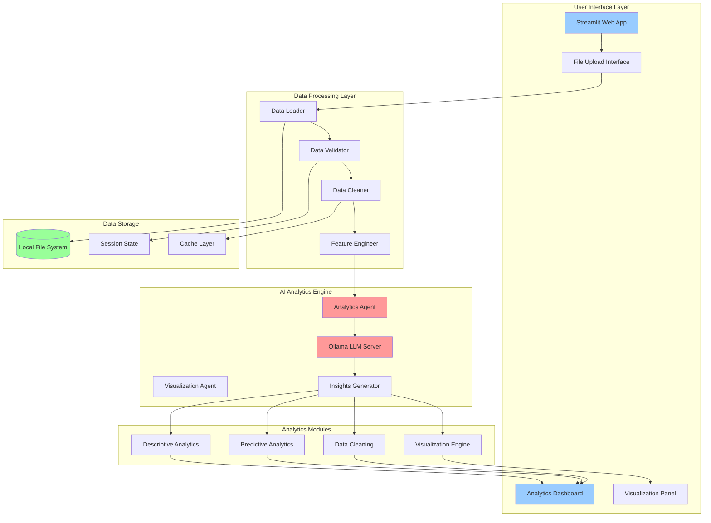
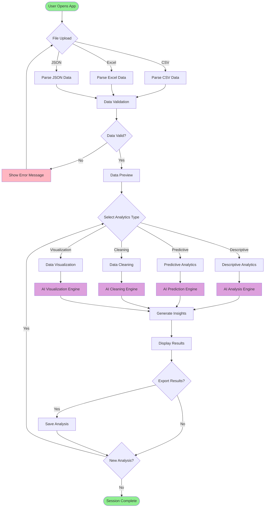
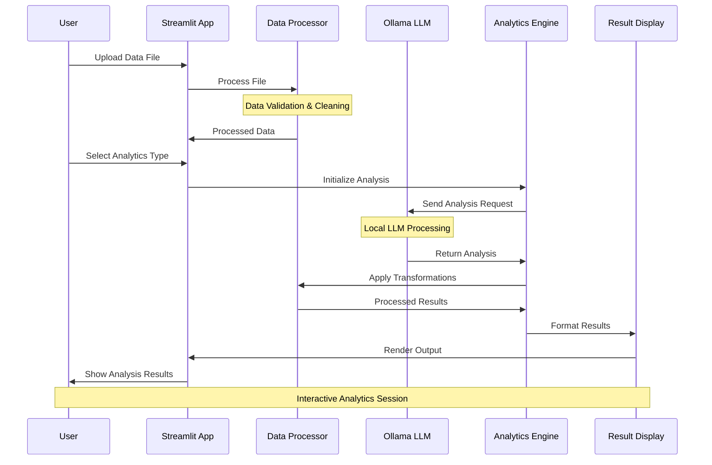
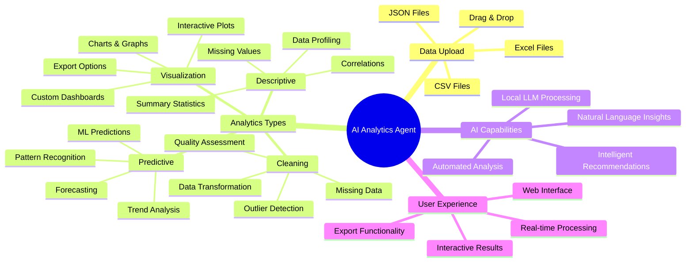

# AI Data Analytics Agent (Ollama + Streamlit)

> Intelligent data analytics platform powered by local LLMs and Streamlit for comprehensive data analysis workflows

[](https://www.python.org/downloads/)
[  
🐙 **GitHub:** [https://github.com/somesh-ghaturle](https://github.com/somesh-ghaturle)  
💼 **LinkedIn:** [https://www.linkedin.com/in/someshghaturle/](https://www.linkedin.com/in/someshghaturle/)go=Streamlit&logoColor=white)](https://streamlit.io/)
[](https://ollama.ai/)

## Overview

This app is an AI-powered data analytics tool that leverages local LLMs via Ollama and provides an intuitive Streamlit web interface for comprehensive data analysis workflows. Perfect for data scientists, analysts, and researchers who need powerful, privacy-focused analytics capabilities.

## 📚 Table of Contents

- [🏗️ System Architecture](#️-system-architecture)
- [🔄 Analytics Workflow](#-analytics-workflow)
- [🤖 AI Processing Pipeline](#-ai-processing-pipeline)
- [📁 Project Structure](#-project-structure)
- [🎯 Features Overview](#-features-overview)
- [⚙️ Installation & Usage](#️-installation--usage)

## 🏗️ System Architecture



## 🔄 Analytics Workflow



## 🤖 AI Processing Pipeline



## 📁 Project Structure

```bash
AI Data Analytics Agent/
│
├── 📋 Documentation
│   ├── README.md                           # This file
│   ├── AI Data Analytics Agent Documentation.pdf
│   └── requirements.txt                    # Python dependencies
│
├── 🤖 Core Application
│   └── Final Ai Agent.py                   # Main Streamlit application
│
├── 🔧 Configuration
│   ├── .streamlit/                         # Streamlit configuration (if exists)
│   └── config/                            # App configuration files (if exists)
│
├── 📊 Data Processing Modules
│   ├── data_loader.py                     # Data loading utilities (embedded)
│   ├── data_cleaner.py                    # Data cleaning functions (embedded)
│   └── visualization.py                   # Chart generation (embedded)
│
├── 🧠 AI Analytics Engine
│   ├── ollama_client.py                   # Ollama integration (embedded)
│   ├── analytics_agent.py                # Analytics processing (embedded)
│   └── insights_generator.py             # Insights generation (embedded)
│
└── 💾 Data & Cache
    ├── uploads/                           # Temporary uploaded files
    ├── cache/                            # Session cache
    └── exports/                          # Generated reports
```

## 🎯 Features Overview



## ⚙️ Installation & Usage

### Prerequisites

- Python 3.8+
- Ollama installed and running locally
- Required Python packages (see requirements.txt)

### Setup Instructions

1. **Install Ollama**

   ```sh
   # macOS
   curl -fsSL https://ollama.ai/install.sh | sh
   
   # Start Ollama service
   ollama serve
   ```

2. **Pull a Language Model**

   ```sh
   # Pull a lightweight model (recommended)
   ollama pull llama2:7b
   
   # Or pull other models
   ollama pull codellama
   ```

3. **Install Python Dependencies**

   ```sh
   pip install -r requirements.txt
   ```

4. **Run the Application**

   ```sh
   streamlit run "Final Ai Agent.py"
   ```

5. **Access the App**

   ```sh
   # Open in browser
   http://localhost:8501
   ```

### Usage Workflow

1. **Start the Application** - Launch the Streamlit app
2. **Upload Your Data** - Drag and drop CSV, Excel, or JSON files
3. **Choose Analytics Type** - Select from descriptive, predictive, cleaning, or visualization
4. **AI Processing** - Let the local LLM analyze your data
5. **Review Results** - Examine insights, charts, and recommendations
6. **Export Analysis** - Save results for future reference

### Key Features

- Upload CSV, Excel, or JSON data
- AI-powered descriptive and predictive analytics
- Automated data cleaning and quality assessment
- Interactive visualizations and dashboards
- Natural language insights generation
- Privacy-focused local processing

### Important Notes

- Ollama must be running locally for the app to work
- Ensure you have sufficient RAM for the chosen LLM model
- Large datasets may take longer to process
- All data processing happens locally for privacy

### Troubleshooting

- **Ollama connection error:** Make sure `ollama serve` is running and the model is pulled
- **Memory issues:** Try using a smaller LLM model or reduce dataset size
- **Import errors:** Verify all dependencies are installed with `pip install -r requirements.txt`
- **Port conflicts:** Check if port 8501 is available or specify a different port

## �‍💻 Author & License

All code and content in this repository is for educational and personal use.

**Somesh Ramesh Ghaturle**  
MS in Data Science, Pace University

---

### Built with ❤️ using Streamlit, Ollama, and Python
