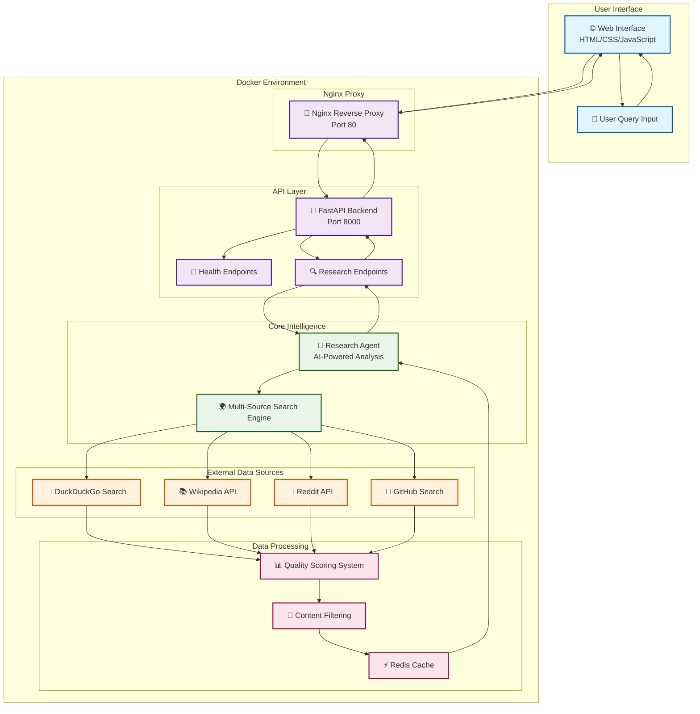
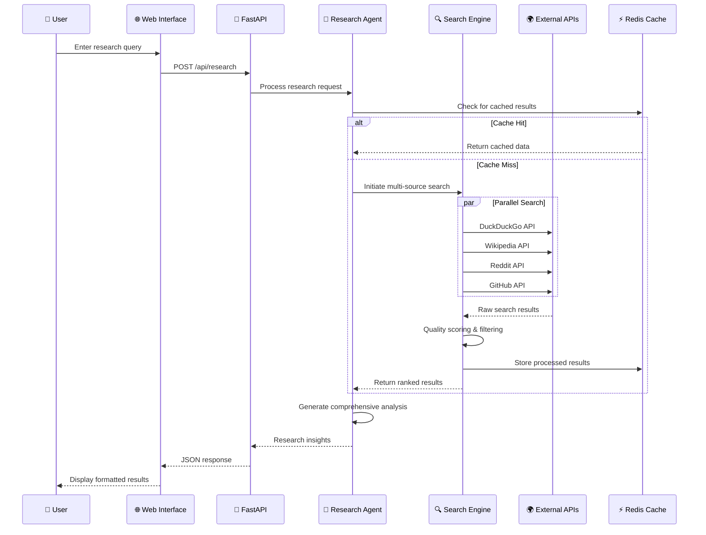

# AgenTech Research Hub 🚀

> Advanced AI Research Platform with Real Internet Search & Multi-Agent Collaboration

[](https://www.python.org/downloads/)
[](https://fastapi.tiangolo.com/)
[](https://www.docker.com/)
[](https://opensource.org/licenses/MIT)

## 🌟 Overview

AgenTech Research Hub is a powerful AI-driven research platform that performs **real internet searches** across multiple sources including DuckDuckGo, Wikipedia, Reddit, and GitHub. Built with FastAPI and featuring a modern web interface, it provides intelligent topic detection, multi-source research aggregation, and professional reporting.

## ✨ Key Features

- 🔍 **Real Internet Search**: Actual web scraping from multiple sources (not mock data)
- 🎯 **Intelligent Topic Detection**: Automatically categorizes research queries
- 🌐 **Multi-Source Research**: DuckDuckGo, Wikipedia, Reddit, GitHub integration
- 📊 **Quality Scoring**: Relevance and credibility assessment of sources
- 🎨 **Professional Web UI**: Modern, responsive interface with blue corporate theme
- 🐳 **Docker Ready**: Complete containerization with nginx load balancing
- ⚡ **FastAPI Backend**: High-performance async API with automatic documentation
- 🔄 **CORS Support**: Cross-origin requests handled seamlessly

## 🚀 Quick Start

### Option 1: Docker (Recommended)

```bash
# Clone the repository
git clone <repository-url>
cd "AgenTech Research Hub"

# Start with Docker Compose
docker-compose up -d

# Access the application
# Web UI: http://localhost:3000
# API Docs: http://localhost:8000/docs
# Health Check: http://localhost:3000/health
```

### Option 2: Local Development

```bash
# Install dependencies
pip install -r requirements.txt

# Start the API server
python api_server.py

# Open web UI
open web-ui/index.html
```

## 🏗️ System Architecture



## 🔄 Research Workflow



### Components

- **FastAPI Backend**: Handles research requests and web scraping
- **Nginx Proxy**: Serves static files and proxies API calls
- **Web UI**: Modern JavaScript interface with auto-detection
- **Redis Cache**: Optional caching layer for improved performance

## 📊 Search Sources

| Source | Purpose | Data Type |
|--------|---------|-----------|
| **DuckDuckGo** | General web search | Instant answers, web results |
| **Wikipedia** | Encyclopedia articles | Structured knowledge |
| **Reddit** | Community discussions | Social insights, trends |
| **GitHub** | Code repositories | Technical documentation |

## 📁 Project Structure

```
AgenTech Research Hub/
├── 🐳 api_server.py                 # Main FastAPI application
├── 🐳 docker-compose.yml            # Multi-container orchestration
├── 🐳 Dockerfile                    # Container configuration
├── 🔧 nginx.conf                    # Reverse proxy configuration
├── 📄 requirements.txt              # Python dependencies
├── 🚀 start_server.sh              # Launch script (Unix)
├── 🛑 stop_server.sh               # Stop script (Unix)
├── 🧪 test_docker.sh               # Docker testing script
├── 📖 README.md                     # This documentation
├── 📄 LICENSE                       # Project license
├── 📁 src/                          # Source code
│   ├── 📁 agents/                   # AI agent implementations
│   │   ├── 🤖 researcher_agent.py   # Main research agent
│   │   ├── 🎯 topic_detector.py     # Topic classification
│   │   └── 📊 quality_scorer.py     # Source quality assessment
│   ├── 📁 api/                      # API route handlers
│   │   ├── 🌐 routes.py             # HTTP endpoints
│   │   └── 🔧 middleware.py         # CORS & error handling
│   ├── 📁 core/                     # Core application logic
│   │   ├── ⚙️ config.py             # Configuration management
│   │   └── 📋 models.py             # Data models
│   ├── 📁 config/                   # Configuration files
│   │   ├── ⚙️ settings.py           # Application settings
│   │   └── 🗄️ database.py          # Database configuration
│   ├── 📁 crews/                    # CrewAI implementations
│   │   ├── 👥 research_crew.py      # Multi-agent coordination
│   │   └── 📋 crew_config.py        # Crew configuration
│   ├── 📁 utils/                    # Utility functions
│   │   ├── 🔧 helpers.py            # Helper functions
│   │   └── 📝 logger.py             # Logging configuration
│   └── 📁 workflows/                # Workflow definitions
│       ├── 🔄 research_workflow.py  # Main research process
│       └── 📊 analysis_workflow.py  # Data analysis process
├── 📁 web-ui/                       # Frontend interface
│   ├── 🌐 index.html               # Main web interface
│   ├── 🎨 styles.css               # Professional styling
│   ├── ⚡ script.js                # Interactive functionality
│   └── 📱 favicon.ico              # Site icon
├── 📁 tests/                        # Test suite
│   ├── 🧪 test_api.py              # API endpoint tests
│   ├── 🤖 test_agents.py           # Agent functionality tests
│   ├── 📊 test_integration.py      # Integration tests
│   └── 🔧 conftest.py              # Test configuration
├── 📁 docs/                        # Additional documentation
│   ├── 📄 project_documentation.md # Technical documentation
│   ├── 📄 DOCKER_SUCCESS.md       # Docker deployment guide
│   └── 📄 PROJECT_CLEANUP_SUMMARY.md # Project organization notes
├── 📁 data/                        # Application data
│   ├── 📁 cache/                   # Cached search results
│   ├── 📁 logs/                    # Application logs
│   ├── 📁 checkpoints/             # Model checkpoints
│   ├── 📁 models/                  # Trained models
│   ├── 📁 outputs/                 # Generated outputs
│   ├── 📁 processed/               # Processed data
│   ├── 📁 raw/                     # Raw data files
│   └── 📁 vector_db/               # Vector database
├── 📁 examples/                     # Usage examples
│   ├── 📝 basic_usage.py           # Basic API usage
│   ├── 🔄 workflow_example.py      # Workflow demonstration
│   └── 📊 analysis_example.py      # Analysis examples
├── 📁 logs/                        # System logs
│   ├── 📋 api.log                  # API request logs
│   ├── 🤖 agent.log               # Agent activity logs
│   └── 🐳 docker.log              # Container logs
└── 📁 scripts/                     # Utility scripts
    ├── 🔧 setup.py                # Environment setup
    ├── 📊 benchmark.py            # Performance testing
    └── 🧹 cleanup.py              # Cleanup utilities
```

## 🎯 Features & Capabilities

### 🔍 **Real Internet Search**
- **Live Data Scraping**: Actual web scraping from multiple sources
- **Rate Limiting**: Respectful API usage with proper delays
- **Error Handling**: Robust fallback mechanisms for failed requests
- **Quality Filtering**: Advanced content relevance scoring

### 🤖 **AI-Powered Analysis**
- **Topic Detection**: Automatic categorization of research queries
- **Source Ranking**: Intelligent prioritization based on credibility
- **Content Synthesis**: Comprehensive analysis generation
- **Trend Identification**: Pattern recognition across data sources

### 🌐 **Professional Web Interface**
- **Responsive Design**: Mobile-friendly interface
- **Real-time Updates**: Live search progress indicators
- **Professional Styling**: Corporate blue theme
- **Auto-detection**: Smart query type recognition

### 🐳 **Production Ready**
- **Docker Containerization**: Easy deployment and scaling
- **Nginx Load Balancing**: High-performance request handling
- **Health Monitoring**: Comprehensive system health checks
- **Logging & Monitoring**: Detailed application insights

## 📖 API Documentation

### Health Check Endpoint

```bash
GET /health
```

**Response:**
```json
{
  "status": "healthy",
  "timestamp": "2024-01-15T10:30:00Z",
  "version": "1.0.0"
}
```

### Research Endpoint

```bash
POST /api/research
Content-Type: application/json

{
  "query": "artificial intelligence trends 2024",
  "sources": ["duckduckgo", "wikipedia", "reddit", "github"],
  "max_results": 10
}
```

**Response:**
```json
{
  "query": "artificial intelligence trends 2024",
  "topic": "Technology",
  "results": [
    {
      "source": "duckduckgo",
      "title": "AI Trends 2024",
      "url": "https://example.com/ai-trends",
      "content": "Latest developments in AI...",
      "quality_score": 0.95,
      "relevance_score": 0.92
    }
  ],
  "summary": "Comprehensive analysis of AI trends...",
  "timestamp": "2024-01-15T10:30:00Z"
}
```

## 🔧 Configuration

### Environment Variables

```bash
# API Configuration
API_HOST=0.0.0.0
API_PORT=8000
DEBUG=false

# Search Configuration
ENABLE_DUCKDUCKGO=true
ENABLE_WIKIPEDIA=true
ENABLE_REDDIT=true
ENABLE_GITHUB=true

# Cache Configuration
REDIS_URL=redis://localhost:6379
CACHE_TTL=3600

# Rate Limiting
RATE_LIMIT_PER_MINUTE=60
REQUEST_TIMEOUT=30
```

### Docker Configuration

```yaml
# docker-compose.yml
version: '3.8'
services:
  agentech-api:
    build: .
    ports:
      - "8000:8000"
    environment:
      - DEBUG=false
      - API_HOST=0.0.0.0
    
  nginx:
    image: nginx:alpine
    ports:
      - "3000:80"
    volumes:
      - ./nginx.conf:/etc/nginx/nginx.conf
      - ./web-ui:/usr/share/nginx/html
```

## 🧪 Testing

### Run Tests

```bash
# Install test dependencies
pip install pytest pytest-asyncio

# Run all tests
pytest tests/

# Run specific test categories
pytest tests/test_api.py -v
pytest tests/test_agents.py -v
pytest tests/test_integration.py -v

# Run with coverage
pytest --cov=src tests/
```

### Test Coverage

```bash
# Generate coverage report
pytest --cov=src --cov-report=html tests/
open htmlcov/index.html
```

## 🐛 Troubleshooting

### Common Issues

#### Docker Issues
- **Port conflicts**: Ensure ports 3000 and 8000 are available
- **Permission errors**: Use `sudo` for Docker commands if needed
- **Container startup failures**: Check logs with `docker-compose logs`

#### API Issues
- **Slow responses**: Check internet connection and API rate limits
- **Failed searches**: Verify source availability and API keys
- **Memory issues**: Increase Docker memory allocation

#### Web Interface Issues
- **Blank page**: Check browser console for JavaScript errors
- **API connection errors**: Verify backend is running on port 8000
- **CORS issues**: Ensure proper CORS configuration in FastAPI

### Performance Optimization

```bash
# Monitor container performance
docker stats

# Check API response times
curl -w "@curl-format.txt" -o /dev/null -s "http://localhost:8000/health"

# Profile memory usage
python -m memory_profiler api_server.py
```

## 🔮 Future Enhancements

- **AI Model Integration**: Local LLM support for offline analysis
- **Database Storage**: Persistent storage for research history
- **User Authentication**: Multi-user support with personalized settings
- **Advanced Analytics**: Trend analysis and predictive insights
- **Mobile App**: Native mobile application development
- **API Rate Limiting**: Enhanced rate limiting and quota management

## 🤝 Contributing

1. Fork the repository
2. Create your feature branch (`git checkout -b feature/AmazingFeature`)
3. Commit your changes (`git commit -m 'Add some AmazingFeature'`)
4. Push to the branch (`git push origin feature/AmazingFeature`)
5. Open a Pull Request

## 🔗 Links

- **Web UI**: <http://localhost:3000>
- **API Documentation**: <http://localhost:8000/docs>
- **Health Monitor**: <http://localhost:3000/health>

---

## 👨‍💻 Author & License

All code and content in this repository is for educational and personal use.

**Somesh Ramesh Ghaturle**  
MS in Data Science, Pace University

📧 **Email:** [someshghaturle@gmail.com](mailto:someshghaturle@gmail.com)  
🐙 **GitHub:** [https://github.com/somesh-ghaturle](https://github.com/somesh-ghaturle)  
💼 **LinkedIn:** [https://www.linkedin.com/in/someshghaturle/](https://www.linkedin.com/in/someshghaturle/)

---

### Built with ❤️ using FastAPI, Docker, and Modern Web Technologies
