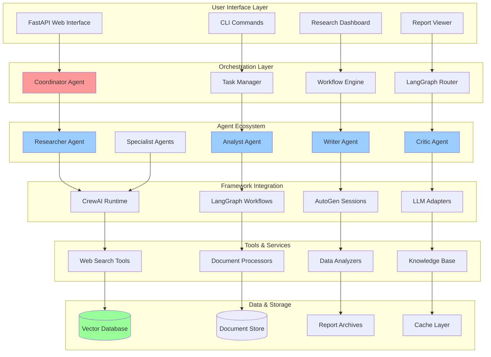
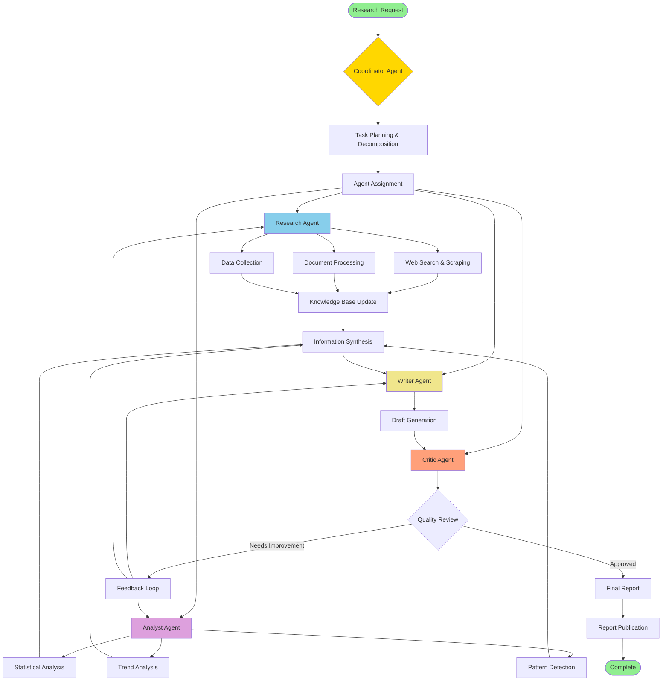
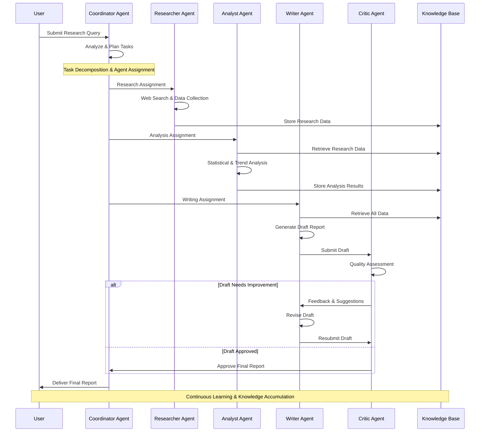
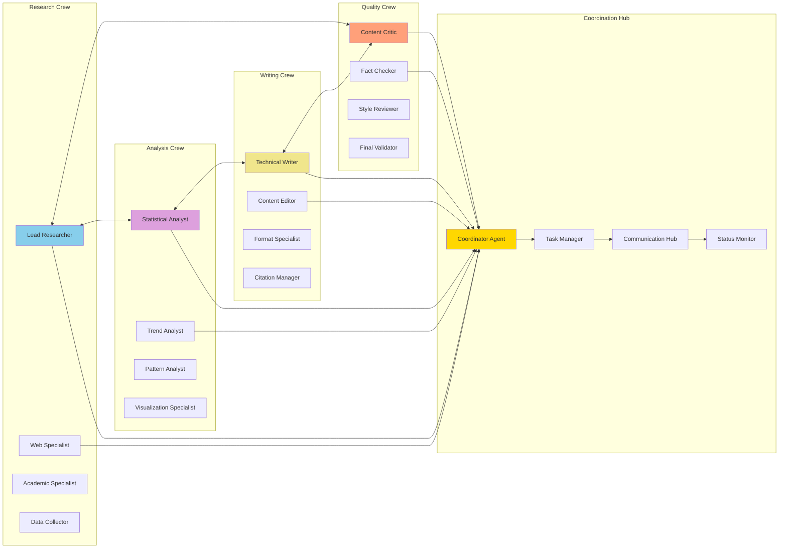
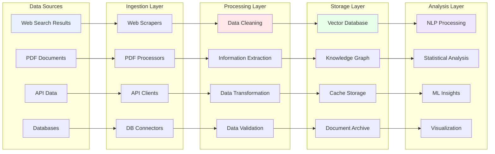
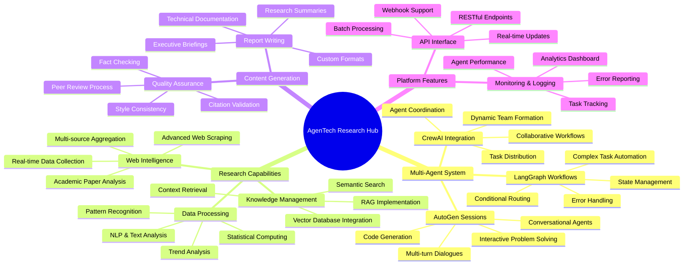

# AgenTech Research Hub 🚀

> Advanced Multi-Agent Research Platform powered by CrewAI, LangGraph, and AutoGen

[](https://www.python.org/downloads/)
[](https://www.crewai.com/)
[](https://langchain-ai.github.io/langgraph/)
[](https://microsoft.github.io/autogen/)
[](https://fastapi.tiangolo.com/)

## Overview

This project implements an advanced **agentic AI system** using cutting-edge multi-agent frameworks like CrewAI, LangGraph, and AutoGen. The system features autonomous AI agents that can collaborate, research, analyze, and generate comprehensive reports on any topic.

## 📚 Table of Contents

- [🏗️ System Architecture](#️-system-architecture)
- [🤖 Multi-Agent Workflow](#-multi-agent-workflow)
- [🔄 Research Process Flow](#-research-process-flow)
- [🧠 Agent Interaction Diagram](#-agent-interaction-diagram)
- [📊 Data Processing Pipeline](#-data-processing-pipeline)
- [📁 Project Structure](#-project-structure)
- [🎯 Features & Capabilities](#-features--capabilities)
- [⚙️ Installation & Usage](#️-installation--usage)

## 🏗️ System Architecture



## 🤖 Multi-Agent Workflow



## 🔄 Research Process Flow



## 🧠 Agent Interaction Diagram



## 📊 Data Processing Pipeline



## 📁 Project Structure

```bash
AgenTech Research Hub/
│
├── 📋 Configuration & Setup
│   ├── README.md                           # This comprehensive documentation
│   ├── TECHNICAL_DOCUMENTATION.md         # Technical implementation details
│   ├── TESTING_SUMMARY.md                # Testing strategies and results
│   ├── requirements.txt                    # Python dependencies
│   ├── .env.example                       # Environment variables template
│   ├── .gitignore                         # Git exclusion rules
│   └── api_server.py                      # FastAPI application entry point
│
├── 🤖 Agent Framework
│   └── src/
│       ├── agents/                        # Multi-agent system
│       │   ├── base_agent.py             # Base agent class
│       │   ├── researcher_agent.py       # Research specialist
│       │   ├── analyst_agent.py          # Data analysis specialist
│       │   ├── writer_agent.py           # Content generation specialist
│       │   ├── critic_agent.py           # Quality assurance specialist
│       │   └── coordinator_agent.py      # Orchestration specialist
│       │
│       ├── crews/                         # CrewAI configurations
│       │   ├── research_crew.py          # Research team setup
│       │   └── analysis_crew.py          # Analysis team setup
│       │
│       ├── workflows/                     # LangGraph workflows
│       │   ├── research_workflow.py      # Research automation
│       │   └── report_workflow.py        # Report generation
│       │
│       └── tools/                         # Agent tools & capabilities
│           ├── web_search.py             # Web search capabilities
│           ├── pdf_processor.py          # Document processing
│           ├── data_analyzer.py          # Data analysis tools
│           └── knowledge_base.py         # RAG integration
│
├── 🔧 Core Infrastructure
│   └── src/
│       ├── core/
│       │   └── base.py                   # Core system components
│       ├── config/
│       │   └── settings.py               # System configuration
│       ├── utils/
│       │   └── helpers.py                # Utility functions
│       └── api/
│           └── routes.py                 # API endpoint definitions
│
├── 🧪 Testing & Validation
│   └── tests/
│       ├── test_agents.py                # Agent functionality tests
│       ├── test_crews.py                 # Crew coordination tests
│       └── conftest.py                   # Test configuration
│
├── 📊 Data Management
│   └── data/
│       ├── raw/                          # Raw data sources
│       ├── processed/                    # Processed datasets
│       ├── reports/                      # Generated research reports
│       └── knowledge_base/               # Vector database storage
│
├── 📚 Documentation & Examples
│   ├── docs/                             # Additional documentation
│   ├── examples/                         # Usage examples and demos
│   └── logs/                            # System logs and monitoring
│
└── 🛠️ Development Tools
    ├── scripts/                          # Setup and utility scripts
    ├── venv/                            # Virtual environment
    └── .env                             # Local environment configuration
```

## 🎯 Features & Capabilities



## ⚙️ Installation & Usage

### Prerequisites

- Python 3.9+
- OpenAI API key (or other LLM provider)
- Vector database (ChromaDB/Pinecone)
- Git for version control

### Quick Start

1. **Clone the Repository**

   ```bash
   git clone https://github.com/somesh-ghaturle/Projects.git
   cd "Projects/AgenTech Research Hub"
   ```

2. **Set Up Virtual Environment**

   ```bash
   python -m venv venv
   source venv/bin/activate  # On macOS/Linux
   # or
   venv\Scripts\activate     # On Windows
   ```

3. **Install Dependencies**

   ```bash
   pip install -r requirements.txt
   ```

4. **Configure Environment**

   ```bash
   cp .env.example .env
   # Edit .env with your API keys and configuration
   ```

5. **Initialize Knowledge Base**

   ```bash
   python scripts/setup.py
   ```

6. **Start the Platform**

   ```bash
   # Option 1: Command Line Interface
   python src/main.py --research "AI trends in 2024"
   
   # Option 2: FastAPI Web Interface
   python api_server.py
   # Then visit http://localhost:8000
   ```

### Usage Examples

#### Research Query

```python
from src.main import ResearchHub

hub = ResearchHub()
result = hub.research(
    topic="Quantum Computing Applications",
    depth="comprehensive",
    agents=["researcher", "analyst", "writer"]
)
print(result.report)
```

#### Custom Agent Crew

```python
from src.crews.research_crew import create_research_crew

crew = create_research_crew(
    research_focus="climate_change",
    expertise_level="expert",
    output_format="academic_paper"
)

result = crew.kickoff()
```

### Key Features

- **Multi-Agent Collaboration**: Autonomous agents working together using CrewAI
- **Intelligent Workflows**: Complex task automation with LangGraph
- **Advanced Research**: Web scraping, academic paper analysis, data synthesis
- **Dynamic Report Generation**: Comprehensive, well-structured research reports
- **RAG Integration**: Knowledge base with vector search capabilities
- **Real-time Coordination**: Agents communicate and coordinate tasks automatically
- **Quality Assurance**: Built-in critique and validation mechanisms

### Technology Stack

- **Agentic AI Frameworks**: CrewAI, LangGraph, AutoGen
- **LLM Integration**: OpenAI GPT-4, Claude, Local LLMs (Ollama)
- **Vector Database**: ChromaDB, Pinecone
- **Web Scraping**: BeautifulSoup, Playwright, Scrapy
- **Data Processing**: Pandas, NumPy, PyPDF2
- **API Framework**: FastAPI with async support
- **Task Queue**: Celery for background processing

### Development Status

🚧 **Active Development** - Advanced multi-agent research platform in progress

### Contributing

This is a personal research and development project focused on exploring cutting-edge agentic AI capabilities.

## 📄 License

Private research project - Educational and experimental use only.

---

**Built with 🧠 using CrewAI, LangGraph, AutoGen, and FastAPI**
