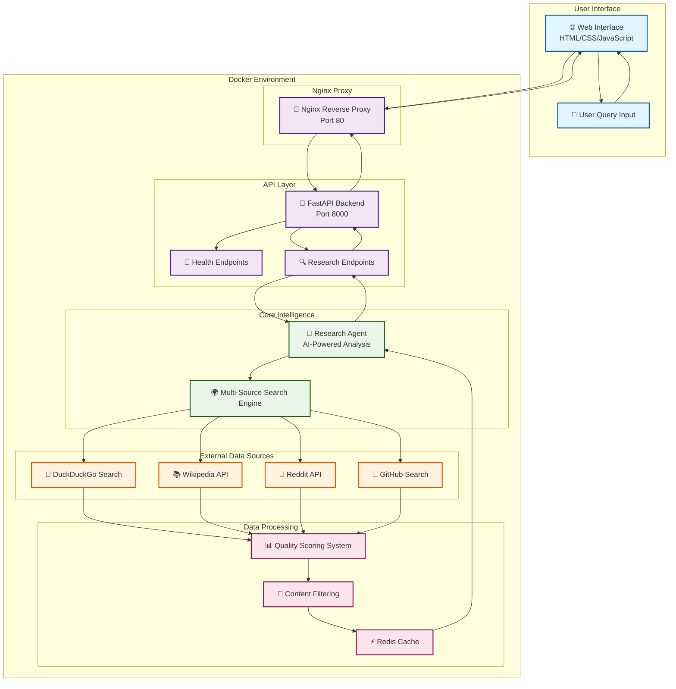
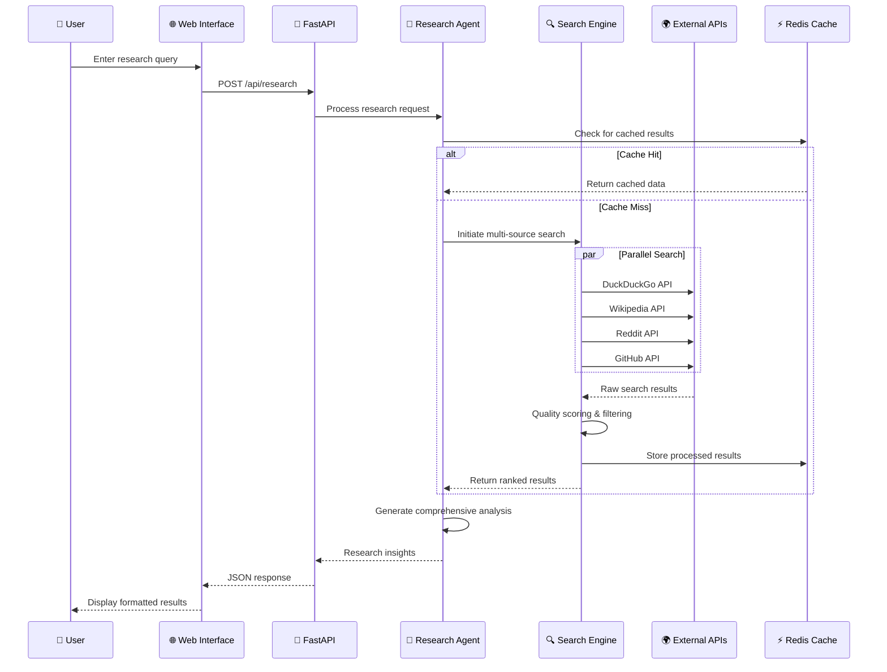

# Ag[](https://www.python.org/downloads/)
[](https://fastapi.tiangolo.com/)
[](https://www.docker.com/)
[](https://opensource.org/licenses/MIT)h Research Hub 🚀

> Advanced AI Research Platform with Real Internet Search & Multi-Agent Collaboration

[](https://www.python.org/downloads/)
[](https://fastapi.tiangolo.com/)
[  
🐙 **GitHub:** [https://github.com/somesh-ghaturle](https://github.com/somesh-ghaturle)  
💼 **LinkedIn:** [https://www.linkedin.com/in/someshghaturle/](https://www.linkedin.com/in/someshghaturle/)

--- License

All code and content in this repository is for educational and personal use.

**Somesh Ramesh Ghaturle**  
MS in Data Science, Pace University

📧 **Email:** [someshghaturle@gmail.com](mailto:someshghaturle@gmail.com)  
🐙 **GitHub:** [https://github.com/somesh-ghaturle](https://github.com/somesh-ghaturle)  
💼 **LinkedIn:** [https://www.linkedin.com/in/someshghaturle/](https://www.linkedin.com/in/someshghaturle/)Color=white)](https://www.docker.com/)
[](https://opensource.org/licenses/MIT)

## 🌟 Overview

AgenTech Research Hub is a powerful AI-driven research platform that performs **real internet searches** across multiple sources including DuckDuckGo, Wikipedia, Reddit, and GitHub. Built with FastAPI and featuring a modern web interface, it provides intelligent topic detection, multi-source research aggregation, and professional reporting.

## ✨ Key Features

- 🔍 **Real Internet Search**: Actual web scraping from multiple sources (not mock data)
- 🎯 **Intelligent Topic Detection**: Automatically categorizes research queries
- 🌐 **Multi-Source Research**: DuckDuckGo, Wikipedia, Reddit, GitHub integration
- 📊 **Quality Scoring**: Relevance and credibility assessment of sources
- 🎨 **Professional Web UI**: Modern, responsive interface with blue corporate theme
- 🐳 **Docker Ready**: Complete containerization with nginx load balancing
- ⚡ **FastAPI Backend**: High-performance async API with automatic documentation
- 🔄 **CORS Support**: Cross-origin requests handled seamlessly

## 🚀 Quick Start

### Option 1: Docker (Recommended)

```bash
# Clone the repository
git clone <repository-url>
cd "AgenTech Research Hub"

# Start with Docker Compose
docker-compose up -d

# Access the application
# Web UI: http://localhost:3000
# API Docs: http://localhost:8000/docs
# Health Check: http://localhost:3000/health
```

### Option 2: Local Development

```bash
# Install dependencies
pip install -r requirements.txt

# Start the API server
python api_server.py

# Open web UI
open web-ui/index.html
```

## 🏗️ System Architecture



## 🔄 Research Workflow



### Components

- **FastAPI Backend**: Handles research requests and web scraping
- **Nginx Proxy**: Serves static files and proxies API calls
- **Web UI**: Modern JavaScript interface with auto-detection
- **Redis Cache**: Optional caching layer for improved performance

## 📊 Search Sources

| Source | Purpose | Data Type |
|--------|---------|-----------|
| **DuckDuckGo** | General web search | Instant answers, web results |
| **Wikipedia** | Authoritative content | Encyclopedia articles |
| **Reddit** | Community insights | Discussions, trends |
| **GitHub** | Technical content | Code repositories, documentation |

## 🌐 API Endpoints

### Core Endpoints

```bash
# Health check
GET /health

# Research endpoint
POST /research
{
  "query": "your research topic",
  "context": {"max_results": 10}
}

# System status
GET /status
```

### Response Format

```json
{
  "success": true,
  "query": "machine learning trends 2025",
  "sources_found": 8,
  "sources": [
    {
      "source_type": "SEARCH_ENGINE",
      "title": "ML Trends 2025",
      "url": "https://example.com",
      "snippet": "Latest developments...",
      "relevance_score": 0.9
    }
  ],
  "summary": "Research summary...",
  "quality_score": 0.85
}
```

## 📁 Project Structure

```text
AgenTech Research Hub/
├── 📄 README.md                    # Project documentation
├── 📄 LICENSE                      # MIT License
├── 📄 requirements.txt             # Python dependencies
├── 📄 .gitignore                   # Git ignore patterns
├── 📄 .env.example                 # Environment variables template
├── 📄 api_server.py                # FastAPI main application (entry point)
├── 🐳 Dockerfile                   # Container configuration
├── � docker-compose.yml           # Multi-service Docker setup
├── ⚙️ nginx.conf                   # Nginx reverse proxy configuration
├── 🧪 test_docker.sh               # Docker testing script
├── 📄 start_server.sh              # Server startup script
├── 📄 stop_server.sh               # Server shutdown script
├── �📁 src/                         # Main source code
│   ├── � __init__.py              # Package initialization
│   ├── 📄 main.py                  # Alternative main entry point
│   ├── �📁 agents/                  # AI Agent implementations
│   │   ├── 📄 __init__.py          
│   │   ├── 📄 base_agent.py        # Base agent class
│   │   └── 📄 researcher_agent.py  # Research agent with real web search
│   ├── 📁 api/                     # API route definitions
│   │   ├── 📄 __init__.py          
│   │   └── 📄 routes.py            # FastAPI route handlers
│   ├── 📁 core/                    # Core application logic
│   │   ├── 📄 __init__.py          
│   │   └── 📄 base.py              # Base application classes
│   ├── 📁 config/                  # Configuration management
│   │   ├── 📄 __init__.py          
│   │   └── 📄 settings.py          # Application settings
│   ├── 📁 crews/                   # Multi-agent crew definitions
│   │   ├── 📄 __init__.py          
│   │   └── 📄 research_crew.py     # Research crew coordination
│   ├── 📁 utils/                   # Utility functions
│   │   ├── 📄 __init__.py          
│   │   └── 📄 helpers.py           # Helper functions
│   └── 📁 workflows/               # Workflow definitions
│       ├── 📄 __init__.py          
│       └── 📄 research_workflow.py # Research workflow logic
├── 📁 web-ui/                      # Frontend web interface
│   ├── 📄 index.html               # Main web interface (with inline CSS)
│   ├── 📄 app.js                   # JavaScript application logic
│   └── 📄 test-connection.html     # Connection testing page
├── 📁 tests/                       # Test suite
│   ├── � __init__.py              
│   ├── 📄 conftest.py              # Pytest configuration
│   ├── � test_main.py             # Main application tests
│   └── 📁 data/                    # Test data files
├── 📁 scripts/                     # Utility scripts
│   ├── 📄 setup.py                 # Setup and installation script
│   ├── 📄 run.py                   # Application runner
│   └── 📄 demo.py                  # Demo and examples
├── 📁 examples/                    # Usage examples
│   └── 📄 custom_research_queries.py # Research query examples
├── 📁 docs/                        # Additional documentation
│   └── � project_documentation.md # Technical documentation
├── 📁 data/                        # Data storage directories
│   ├── 📁 cache/                   # Cached data
│   ├── 📁 checkpoints/             # Model checkpoints
│   ├── 📁 logs/                    # Application logs
│   ├── 📁 models/                  # AI model storage
│   ├── 📁 outputs/                 # Generated outputs
│   ├── 📁 processed/               # Processed data
│   ├── 📁 raw/                     # Raw input data
│   └── � vector_db/               # Vector database storage
└── 📁 logs/                        # Runtime logs (Docker)
```

## 🧪 Testing

```bash
# Run all tests
pytest tests/

# Test API endpoints
curl http://localhost:8000/health
curl -X POST http://localhost:8000/research \
  -H "Content-Type: application/json" \
  -d '{"query": "artificial intelligence"}'

# Docker testing
./test_docker.sh
```

## ⚙️ Configuration

### Environment Variables

```bash
# API Configuration
API_HOST=0.0.0.0
API_PORT=8000
LOG_LEVEL=INFO

# Optional: Add API keys for enhanced functionality
OPENAI_API_KEY=your-key-here
ANTHROPIC_API_KEY=your-key-here
```

### Docker Configuration

```yaml
# docker-compose.yml
services:
  agentech-api:     # FastAPI backend on port 8000
  agentech-webui:   # Nginx frontend on port 3000  
  redis:            # Optional caching on port 6379
```

## 🔧 Development

### Adding New Search Sources

1. Implement search method in `src/agents/researcher_agent.py`
2. Add to the `_web_search` method source list
3. Handle rate limiting and error cases
4. Update tests and documentation

### Customizing the UI

1. Modify `web-ui/index.html` for structure
2. Update `web-ui/app.js` for functionality
3. Customize `web-ui/styles.css` for styling
4. Test responsiveness across devices

## 🚨 Troubleshooting

### Common Issues

**Port conflicts:**

```bash
# Check what's using the ports
lsof -i :3000
lsof -i :8000

# Kill conflicting processes
sudo kill -9 <PID>
```

**Docker issues:**

```bash
# Reset Docker setup
docker-compose down
docker system prune -f
docker-compose up --build -d
```

**API connection fails:**

- Check if Docker daemon is running
- Verify nginx proxy configuration
- Check container logs: `docker-compose logs`

## 📈 Performance

- **Response Time**: < 3 seconds for typical research queries
- **Concurrent Users**: Supports multiple simultaneous requests
- **Search Sources**: 4+ integrated sources with intelligent fallbacks
- **Cache Support**: Redis integration for improved performance

## 🤝 Contributing

1. Fork the repository
2. Create a feature branch: `git checkout -b feature-name`
3. Make your changes and add tests
4. Commit changes: `git commit -am 'Add feature'`
5. Push to branch: `git push origin feature-name`
6. Submit a pull request

## 📄 License

This project is licensed under the MIT License - see the [LICENSE](LICENSE) file for details.

## 🔗 Links

- **Web UI**: <http://localhost:3000>
- **API Documentation**: <http://localhost:8000/docs>
- **Health Monitor**: <http://localhost:3000/health>

---

## �‍💻 Author & License

All code and content in this repository is for educational and personal use.

**Somesh Ramesh Ghaturle**  
MS in Data Science, Pace University

---

### Built with ❤️ using FastAPI, Docker, and Modern Web Technologies
