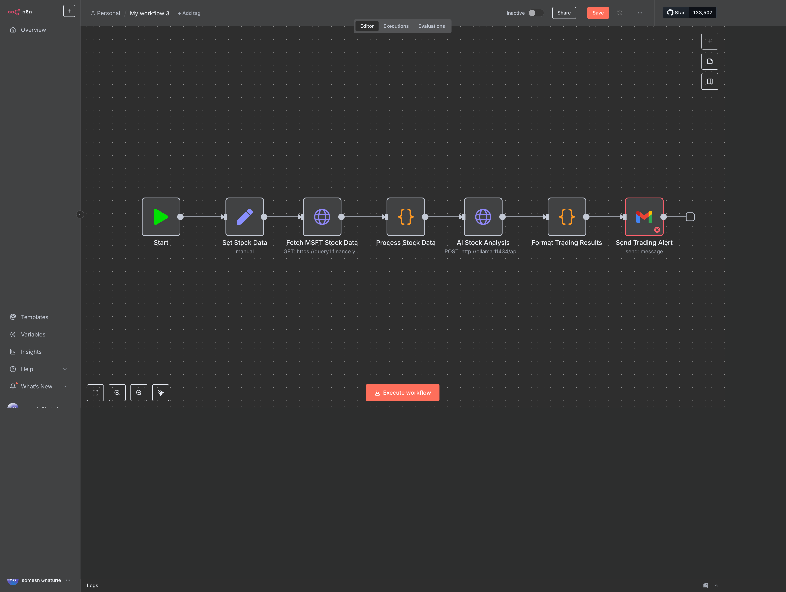
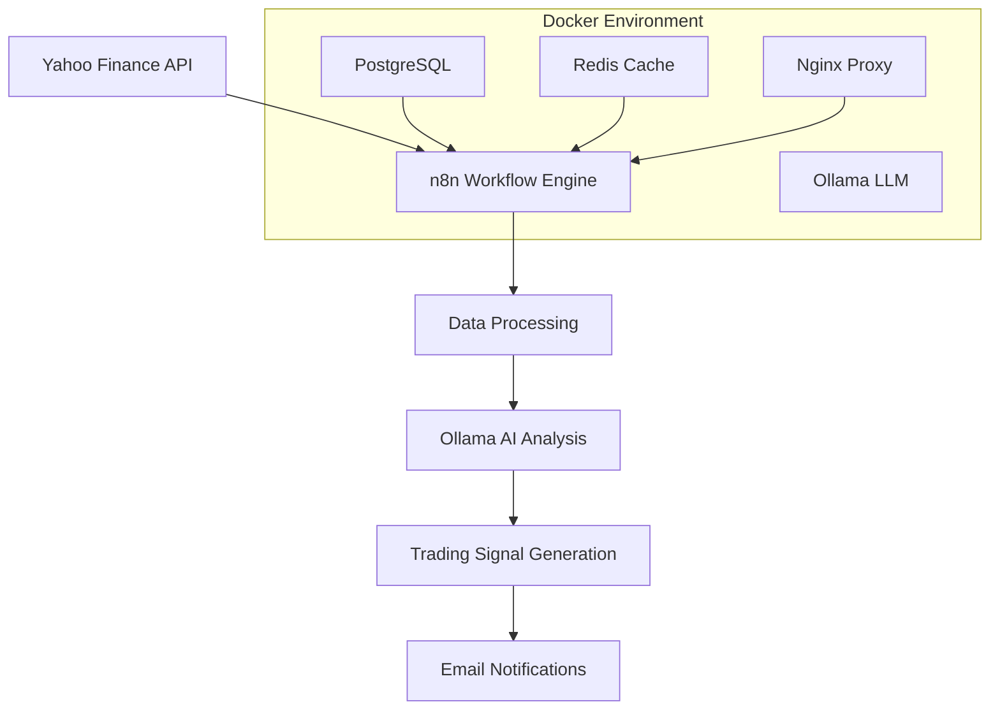

# 🤖 AI-Powered Microsoft Stock Trading Platform

<div align="center">



[](https://docker.com)
[](https://n8n.io)
[](https://ollama.ai)
[](https://finance.yahoo.com)
[](LICENSE)

*Intelligent stock trading automation with AI-powered analysis and real-time email alerts*

[Features](#-features) • [Quick Start](#-quick-start) • [Architecture](#-architecture) • [Workflows](#-workflows) • [API Reference](#-api-reference)

</div>

---

## 📋 Table of Contents

- [🎯 Overview](#-overview)
- [✨ Features](#-features)
- [🚀 Quick Start](#-quick-start)
- [🏗️ Architecture](#️-architecture)
- [📊 Workflows](#-workflows)
- [🔧 Configuration](#-configuration)
- [📖 API Reference](#-api-reference)
- [🐳 Docker Deployment](#-docker-deployment)
- [🛠️ Development](#️-development)
- [📈 Usage Examples](#-usage-examples)
- [🔍 Troubleshooting](#-troubleshooting)
- [🤝 Contributing](#-contributing)
- [📝 License](#-license)

---

## 📸 Preview

### 🖥️ **n8n Workflow Interface**


### 🎯 **Live Demo Features**
- **Real-time MSFT data processing** from Yahoo Finance API
- **AI-powered analysis** using local Ollama LLM models  
- **Professional email notifications** with trading recommendations
- **Visual workflow editor** for easy customization
- **Complete Docker environment** with health monitoring

### 📊 **Sample Trading Alert Email**
```
📈 Microsoft Stock Trading Analysis

🏷️ Symbol: MSFT
💰 Current Price: $410.60
🎯 Predicted Price: $415.50
📊 Recommendation: BUY
⚖️ Risk Level: MODERATE

💭 Analysis:
The stock shows positive momentum with strong fundamentals.
Recent 10-day trend indicates upward trajectory with good volume.
Technical indicators suggest continued growth potential.

🕐 Generated: 2025-08-29T01:15:00.000Z
---
Automated by AI Trading System
```

---

## 🎯 Overview

The **AI-Powered Microsoft Stock Trading Platform** is an intelligent, automated trading system that combines real-time market data analysis with advanced AI decision-making. Built on n8n workflow automation, it provides sophisticated trading signals, risk assessment, and automated email notifications for Microsoft (MSFT) stock trading.

### 🌟 Key Highlights

- **🧠 AI-Driven Analysis**: Local Ollama LLM provides intelligent trading recommendations
- **📊 Real-Time Data**: Yahoo Finance API integration for live market data
- **📧 Smart Alerts**: Professional email notifications with trading signals
- **🐳 Production-Ready**: Complete Docker containerization with health monitoring
- **🔒 Secure**: Local AI processing with no external API dependencies
- **⚡ High Performance**: Optimized workflow execution with Redis caching

---

## ✨ Features

### 🎯 **Core Trading Features**
- **Real-Time Market Data**: Live MSFT stock price feeds from Yahoo Finance
- **AI Trading Analysis**: Advanced pattern recognition and trend analysis
- **Automated Recommendations**: BUY/SELL/HOLD signals with confidence scoring
- **Risk Assessment**: Comprehensive risk evaluation with each recommendation
- **Price Predictions**: Next-day price forecasting using AI models

### 🔧 **Technical Features**
- **Workflow Automation**: Visual n8n workflows for complex trading logic
- **Local AI Processing**: Ollama integration for private, secure AI analysis
- **Professional Notifications**: HTML email templates with trading metrics
- **Health Monitoring**: Complete service health checks and monitoring
- **Scalable Architecture**: Docker Compose orchestration for easy scaling

### 📊 **Analytics & Reporting**
- **Historical Analysis**: 10-day moving average and trend analysis
- **Performance Tracking**: Trading signal accuracy and performance metrics
- **Email Alerts**: Instant notifications with comprehensive trading data
- **Visual Insights**: Rich data presentation in email reports

---

## 🚀 Quick Start

### Prerequisites

- **Docker & Docker Compose** (Latest version)
- **Git** for cloning the repository
- **Email Account** for trading alerts

### 1️⃣ Clone & Setup

```bash
# Clone the repository
git clone https://github.com/somesh-ghaturle/Projects.git
cd "Projects/Microsoft Stock Price Prediction Workflow (n8n)"

# Copy environment template
cp .env.example .env
```

### 2️⃣ Configure Environment

Edit `.env` file with your settings:

```bash
# n8n Configuration
N8N_USER=admin
N8N_PASSWORD=your_secure_password

# Email Configuration
SMTP_USER=your-email@gmail.com
SMTP_PASSWORD=your-app-password
SMTP_HOST=smtp.gmail.com
SMTP_PORT=587

# Database
DB_PASSWORD=secure_db_password
```

### 3️⃣ Launch Platform

```bash
# Start all services
./start-production.sh

# Verify deployment
docker-compose ps
```

### 4️⃣ Access & Configure

1. **Open n8n Interface**: http://localhost:5678
2. **Login** with credentials from `.env`
3. **Import Workflow**: Upload `workflows/complete-trading-workflow.json`
4. **Configure Email**: Set up SMTP credentials in the email node
5. **Test Workflow**: Execute manually to verify functionality

---

## 🏗️ Architecture

### 🔧 **System Components**



### 🐳 **Docker Services**

| Service | Purpose | Port | Health Check |
|---------|---------|------|-------------|
| **n8n** | Workflow automation platform | 5678 | HTTP /healthz |
| **PostgreSQL** | Workflow and execution data | 5432 | Connection test |
| **Redis** | Caching and session storage | 6379 | PING command |
| **Ollama** | Local AI inference engine | 11434 | API version check |
| **Nginx** | Reverse proxy and load balancer | 80 | HTTP response |

### 🔄 **Data Flow**

1. **Data Ingestion**: Yahoo Finance API → Raw market data
2. **Processing**: n8n workflows → Structured analysis
3. **AI Analysis**: Ollama LLM → Trading insights
4. **Decision Making**: Rule engine → Trading signals
5. **Notification**: Email system → User alerts

---

## 📊 Workflows

### 🎯 **Complete Trading Workflow**
**File**: `workflows/complete-trading-workflow.json`

**Purpose**: End-to-end automated trading analysis with AI recommendations

**Components**:
- **Data Fetcher**: Yahoo Finance integration
- **Data Processor**: Stock price analysis and trend calculation
- **AI Analyzer**: Ollama-powered trading recommendations
- **Result Formatter**: Professional report generation
- **Email Sender**: SMTP-based notification system

### 🧪 **Simple Test Workflow**
**File**: `workflows/simple-test.json`

**Purpose**: Basic API connectivity and data fetching test

**Components**:
- **Stock Data Setter**: Hardcoded MSFT parameters
- **API Tester**: Yahoo Finance connectivity verification

### 📋 **Workflow Execution**

```bash
# Import workflow via n8n UI
1. Navigate to http://localhost:5678
2. Click "Import from file"
3. Select workflow JSON file
4. Configure email credentials
5. Execute workflow

# Or via API
curl -X POST http://localhost:5678/webhook/trading-signal \
  -H "Content-Type: application/json" \
  -d '{"symbol": "MSFT", "action": "analyze"}'
```

---

## 🔧 Configuration

### 📧 **Email Setup**

#### Gmail App Password Method:
1. Enable 2-Factor Authentication
2. Generate App Password: Google Account → Security → App passwords
3. Configure SMTP settings:

```env
SMTP_HOST=smtp.gmail.com
SMTP_PORT=587
SMTP_USER=your-email@gmail.com
SMTP_PASSWORD=your-16-char-app-password
SMTP_SECURE=true
```

### 🤖 **AI Model Configuration**

```bash
# Check available models
curl http://localhost:11434/api/tags

# Pull additional models (optional)
docker exec n8n-ollama ollama pull llama3.2:latest
docker exec n8n-ollama ollama pull codellama:latest
```

### 📊 **Trading Parameters**

Edit workflow parameters in n8n:

```javascript
// Stock configuration
{
  "ticker": "MSFT",
  "interval": "1d",
  "period": "30d",
  "analysis_depth": 10
}

// AI prompt customization
{
  "prompt_template": "Analyze MSFT with focus on...",
  "risk_tolerance": "moderate",
  "prediction_horizon": "1d"
}
```

---

## 📖 API Reference

### 🔌 **Yahoo Finance Integration**

```bash
# Get stock data
GET https://query1.finance.yahoo.com/v8/finance/chart/MSFT
Parameters:
  - interval: 1d, 1h, 5m
  - period1: Unix timestamp (start)
  - period2: Unix timestamp (end)
```

### 🧠 **Ollama AI API**

```bash
# Generate trading analysis
POST http://ollama:11434/api/generate
{
  "model": "llama3:latest",
  "prompt": "Analyze stock data and provide trading recommendation",
  "stream": false
}
```

### 📧 **Email Notification Format**

```html
<!DOCTYPE html>
<html>
<head>
    <title>MSFT Trading Alert</title>
</head>
<body>
    <h2>📈 Microsoft Stock Trading Analysis</h2>
    <p><strong>Symbol:</strong> MSFT</p>
    <p><strong>Current Price:</strong> $410.60</p>
    <p><strong>Recommendation:</strong> BUY</p>
    <p><strong>Predicted Price:</strong> $415.50</p>
    <p><strong>Risk Level:</strong> MODERATE</p>
    <p><strong>Analysis:</strong> Positive trend with strong fundamentals...</p>
</body>
</html>
```

---

## 🐳 Docker Deployment

### 🚀 **Production Deployment**

```bash
# Quick production start
./start-production.sh

# Manual deployment
docker-compose -f docker-compose.production.yml up -d

# Health check
./scripts/health_check.sh
```

### 📊 **Service Management**

```bash
# View logs
docker-compose logs -f n8n
docker-compose logs -f ollama

# Restart services
docker-compose restart n8n
docker-compose restart ollama

# Scale services
docker-compose up -d --scale n8n=2
```

### 🔍 **Monitoring**

```bash
# Check service status
docker-compose ps

# Resource usage
docker stats

# Health checks
curl http://localhost:5678/healthz
curl http://localhost:11434/api/version
```

---

## 🛠️ Development

### 🏃‍♂️ **Development Setup**

```bash
# Start development environment
./start-development.sh

# Enable debug mode
export N8N_LOG_LEVEL=debug
docker-compose up

# Develop workflows
# Edit workflows in n8n UI
# Export workflows to /workflows directory
```

### 🧪 **Testing**

```bash
# Test Yahoo Finance API
curl "https://query1.finance.yahoo.com/v8/finance/chart/MSFT?interval=1d"

# Test Ollama
curl -X POST http://localhost:11434/api/generate \
  -H "Content-Type: application/json" \
  -d '{"model": "llama3:latest", "prompt": "Test prompt", "stream": false}'

# Test workflow execution
./test_web_interface.sh
```

### 📝 **Workflow Development**

1. **Design in n8n UI**: Visual workflow editor
2. **Test individually**: Execute nodes step-by-step
3. **Export workflow**: Download as JSON
4. **Version control**: Commit to `/workflows` directory

---

## 📈 Usage Examples

### 🎯 **Manual Execution**

```bash
# Execute workflow via webhook
curl -X POST http://localhost:5678/webhook/msft-analysis \
  -H "Content-Type: application/json" \
  -d '{"trigger": "manual", "symbol": "MSFT"}'
```

### ⏰ **Scheduled Execution**

Configure in n8n:
```javascript
// Daily at market open (9:30 AM EST)
{
  "schedule": "30 9 * * 1-5",
  "timezone": "America/New_York"
}
```

### 📊 **Custom Analysis**

```javascript
// Custom prompt for specific analysis
{
  "prompt": "Focus on earnings impact and technical indicators for MSFT",
  "analysis_type": "earnings_focused",
  "risk_tolerance": "conservative"
}
```

---

## 🔍 Troubleshooting

### ❗ **Common Issues**

#### Connection Refused (Ollama)
```bash
# Check Ollama container
docker logs n8n-ollama

# Verify URL in workflow
# Use: http://ollama:11434 (not localhost)
```

#### Yahoo Finance 404 Errors
```bash
# Check date parameters
# Ensure period1 < period2
# Use Unix timestamps

# Test API directly
curl "https://query1.finance.yahoo.com/v8/finance/chart/MSFT"
```

#### Email Delivery Issues
```bash
# Verify SMTP credentials
# Check Gmail App Password
# Test SMTP connection

# Use test email service
docker run --rm -it -p 1025:1025 mailhog/mailhog
```

### 🔧 **Debug Commands**

```bash
# Service health
docker-compose ps
docker-compose logs n8n

# Workflow debugging
# Enable debug mode in n8n
# Check execution logs in UI

# Network connectivity
docker exec n8n-trading-platform ping ollama
docker exec n8n-trading-platform nslookup yahoo.com
```

---

## 🤝 Contributing

We welcome contributions! Please see our [Contributing Guide](CONTRIBUTING.md) for details.

### 📋 **Development Process**

1. **Fork** the repository
2. **Create** feature branch (`git checkout -b feature/amazing-feature`)
3. **Commit** changes (`git commit -m 'Add amazing feature'`)
4. **Push** to branch (`git push origin feature/amazing-feature`)
5. **Open** Pull Request

### 🐛 **Bug Reports**

Please use the [Issue Tracker](https://github.com/somesh-ghaturle/Projects/issues) with:
- Clear description
- Steps to reproduce
- Expected behavior
- System information
- Logs (if applicable)

---

## 📝 License

This project is licensed under the MIT License - see the [LICENSE](LICENSE) file for details.

---

<div align="center">

## 👨‍💻 Created by Somesh Ghaturle

**Senior Software Engineer & AI Enthusiast**

[](https://linkedin.com/in/somesh-ghaturle)
[](https://github.com/somesh-ghaturle)
[](mailto:someshghaturle@gmail.com)

### 🌟 **Expertise**
- **AI/ML Engineering**: Advanced machine learning systems and model deployment
- **Financial Technology**: Algorithmic trading and quantitative analysis
- **Cloud Architecture**: Scalable distributed systems and microservices
- **Automation**: Workflow orchestration and intelligent process automation

### 🚀 **Other Projects**
- [AgenTech Research Hub](../AgenTech%20Research%20Hub/) - Multi-agent AI research platform
- [AI Data Analytics Agent](../AI%20Data%20Analytics%20Agent/) - Intelligent data analysis system
- [Multi-Agent Content Analytics](../Multi-Agent-Content-Analytics/) - Advanced content processing

---

⭐ **If this project helped you, please give it a star!** ⭐

*Built with ❤️ using n8n, Docker, Ollama, and modern AI technologies*

</div>
