# Microsoft Stock Price Prediction Workflow (n8n) 📈

> Automated algorithmic trading signals using n8n workflow automation, LSTM/GRU predictions, and Discord notifications

[](https://n8n.io/)
[](https://www.python.org/downloads/)
[](https://finance.yahoo.com/)
[  
🐙 **GitHub:** [https://github.com/somesh-ghaturle](https://github.com/somesh-ghaturle)  
💼 **LinkedIn:** [https://www.linkedin.com/in/someshghaturle/](https://www.linkedin.com/in/someshghaturle/)s://img.shields.io/badge/Discord-Webhook-5865F2)](https://discord.com/)

## Overview

This project contains an automated n8n workflow for generating algorithmic trading signals (BUY/SELL/HOLD) for Microsoft (MSFT) stock using simulated LSTM/GRU predictions. The workflow integrates multiple data sources, applies machine learning predictions, and delivers actionable trading insights through Discord notifications.

## 📚 Table of Contents

- [🏗️ Workflow Architecture](#️-workflow-architecture)
- [🔄 Trading Process Flow](#-trading-process-flow)
- [📊 Data Pipeline](#-data-pipeline)
- [🤖 Prediction Engine](#-prediction-engine)
- [📱 Notification System](#-notification-system)
- [📁 Project Structure](#-project-structure)
- [⚙️ Setup & Configuration](#️-setup--configuration)

## 🏗️ Workflow Architecture


## 🔄 Trading Process Flow


## 📊 Data Pipeline

```mermaid
sequenceDiagram
    participant Trigger as Schedule Trigger
    participant Config as Configuration Node
    participant Yahoo as Yahoo Finance API
    participant Model as Prediction Model
    participant Signal as Signal Generator
    participant Discord as Discord Webhook
    participant Monitor as Monitoring System
    
    Trigger->>Config: Daily Execution
    Config->>Config: Set MSFT & Date Range
    
    Config->>Yahoo: Request Historical Data
    Yahoo->>Yahoo: Fetch Last 100 Days
    Yahoo->>Config: Return Price Data
    
    Config->>Model: Send Price Data
    Model->>Model: LSTM/GRU Processing
    Model->>Signal: Return Prediction
    
    Signal->>Signal: Calculate Signal Logic
    Signal->>Signal: Apply Thresholds (±2%)
    
    alt BUY Signal
        Signal->>Discord: Send BUY Alert
    else SELL Signal
        Signal->>Discord: Send SELL Alert
    else HOLD Signal
        Signal->>Discord: Send HOLD Alert
    end
    
    Discord->>Monitor: Log Notification
    Monitor->>Monitor: Update Metrics
    
    Note over Trigger,Monitor: Automated Daily Execution Cycle
```



## 🤖 Prediction Engine


## 📱 Notification System


## 📁 Project Structure

```bash
Microsoft Stock Price Prediction Workflow (n8n)/
│
├── 📋 Documentation
│   └── README.md                           # This comprehensive documentation
│
├── 🔄 Workflow Definition
│   └── trading-workflow.json              # Complete n8n workflow configuration
│
├── 🏗️ Workflow Components
│   ├── 01_schedule_trigger.json           # Daily execution scheduler
│   ├── 02_parameter_config.json           # MSFT ticker and date configuration
│   ├── 03_data_fetcher.json              # Yahoo Finance API integration
│   ├── 04_prediction_model.json          # LSTM/GRU simulation engine
│   ├── 05_signal_generator.json          # Trading signal logic
│   └── 06_discord_notifier.json          # Discord webhook notification
│
├── 📊 Configuration Files
│   ├── credentials.json                   # API keys and webhook URLs (template)
│   ├── workflow_settings.json            # Execution parameters
│   └── notification_templates.json       # Discord message formats
│
├── 📈 Data & Outputs
│   ├── historical_data/                  # Downloaded price data cache
│   ├── predictions/                      # Model prediction outputs
│   ├── signals/                         # Generated trading signals
│   └── logs/                            # Execution and error logs
│
└── 🛠️ Development Tools
    ├── test_workflow.json               # Testing configuration
    ├── backup_workflow.json            # Workflow backup
    └── deployment_guide.md             # Setup instructions
```

## ⚙️ Setup & Configuration

### Prerequisites

- [n8n](https://n8n.io/) (self-hosted or desktop application)
- Python 3.8+ (for code nodes in n8n)
- Discord account with webhook access
- Internet connection for Yahoo Finance API access

### Installation Steps

1. **Install n8n**

   ```bash
   # Option 1: Global installation
   npm install n8n -g
   
   # Option 2: Docker
   docker run -it --rm --name n8n -p 5678:5678 n8nio/n8n
   
   # Option 3: Desktop App
   # Download from https://n8n.io/download/
   ```

2. **Start n8n Service**

   ```bash
   # Command line
   n8n start
   
   # Access at http://localhost:5678
   ```

3. **Import Workflow**

   ```bash
   # In n8n interface:
   # 1. Go to "Workflows" → "Import from File"
   # 2. Select trading-workflow.json
   # 3. Confirm import
   ```

4. **Configure Discord Webhook**

   ```bash
   # Create Discord webhook:
   # 1. Discord Server Settings → Integrations → Webhooks
   # 2. Copy webhook URL
   # 3. Add to n8n credentials as "Discord Webhook"
   ```

5. **Set Up Credentials**

   ```bash
   # In n8n:
   # 1. Go to Settings → Credentials
   # 2. Add "Discord Webhook" credential
   # 3. Paste your webhook URL
   # 4. Link to notification node
   ```

6. **Test Workflow**

   ```bash
   # Manual test:
   # 1. Open workflow in n8n
   # 2. Click "Execute Workflow"
   # 3. Check Discord for notification
   # 4. Review execution logs
   ```

### Configuration Options

#### Trading Parameters

```json
{
  "ticker": "MSFT",
  "days_history": 100,
  "buy_threshold": 0.02,
  "sell_threshold": -0.02,
  "schedule": "0 9 * * 1-5"
}
```

#### Notification Templates

```json
{
  "buy_signal": "🚀 **BUY SIGNAL** for ${ticker}\n📈 Predicted: +${percentage}%\n💰 Current: $${price}\n🎯 Target: $${target}",
  "sell_signal": "🔻 **SELL SIGNAL** for ${ticker}\n📉 Predicted: ${percentage}%\n💸 Current: $${price}\n🎯 Target: $${target}",
  "hold_signal": "⏸️ **HOLD SIGNAL** for ${ticker}\n📊 Predicted: ${percentage}%\n💼 Current: $${price}\n🔄 Maintain Position"
}
```

### Key Features

- **Automated Execution**: Daily schedule (customizable timing)
- **Real-time Data**: Yahoo Finance API integration
- **ML Predictions**: LSTM/GRU model simulation (replaceable with real models)
- **Smart Signaling**: Threshold-based BUY/SELL/HOLD logic
- **Rich Notifications**: Formatted Discord alerts with emojis and data
- **Error Handling**: Robust error management and retry logic
- **Monitoring**: Comprehensive logging and execution tracking

### Advanced Customization

#### Replace Simulated Model

```javascript
// Replace simulation node with HTTP Request to real ML API
const response = await fetch('https://your-ml-api.com/predict', {
  method: 'POST',
  headers: { 'Content-Type': 'application/json' },
  body: JSON.stringify({ ticker: 'MSFT', data: historicalData })
});
const prediction = await response.json();
```

#### Multi-Asset Support

```javascript
// Extend for multiple tickers
const tickers = ['MSFT', 'AAPL', 'GOOGL', 'AMZN'];
for (const ticker of tickers) {
  // Execute prediction workflow for each ticker
}
```

### Troubleshooting

- **Yahoo Finance Errors**: Check API rate limits and internet connection
- **Discord Webhook Issues**: Verify webhook URL and Discord server permissions
- **n8n Execution Failures**: Review workflow logs and node configurations
- **Prediction Accuracy**: Consider implementing real ML models for production use

## �‍💻 Author & License

All code and content in this repository is for educational and personal use.

**Somesh Ramesh Ghaturle**  
MS in Data Science, Pace University

---

### Built with 📊 using n8n, Python, Yahoo Finance API, and Discord
