# 🎭 Multi-Agent Content Analytics Platform

> **Advanced AI-powered content analysis system with sophisticated agents for comprehensive movie script analysis, genre classification, and marketing intelligence**

[](https://www.python.org/downloads/)
[](https://fastapi.tiangolo.com/)
[](https://www.docker.com/)
[](https://github.com/somesh-ghaturle/Projects)
[](https://opensource.org/licenses/MIT)

## 🎯 Overview

**Multi-Agent Content Analytics Platform** is a next-generation AI system that revolutionizes content analysis through specialized intelligent agents. Built for entertainment industry professionals, writers, and content creators, the platform provides comprehensive insights into movie scripts, story structures, character development, and market potential.

### ✨ Advanced Features

- **🧠 Sophisticated AI Agents**: Three specialized agents with advanced NLP capabilities
- **📊 Deep Script Analysis**: Scene structure, character arcs, dialogue analysis, and plot development
- **🎭 Advanced Genre Classification**: Multi-dimensional genre analysis with confidence scoring
- **📈 Market Intelligence**: Comprehensive audience targeting, marketing strategies, and competitive analysis
- **🔍 Quality Assessment**: Automated script quality scoring with improvement recommendations
- **⚡ Real-time Processing**: Optimized for fast analysis with detailed progress tracking
- **🌐 Professional Web Interface**: Intuitive UI designed for industry professionals
- **🐳 Enterprise-Ready**: Docker containerized with health monitoring and scalability

## 🏗️ System Architecture

```mermaid
flowchart TB
    subgraph "User Interface"
        UI[🌐 Professional Web Interface<br/>Port 8001/web]
        INPUT[📝 Content Input<br/>Scripts & Screenplays]
        OUTPUT[📊 Analysis Results<br/>Reports & Insights]
    end
    
    subgraph "Docker Environment"
        subgraph "API Layer"
            API[🚀 FastAPI Backend<br/>multi_agent_content_api.py]
            HEALTH[💚 Health Monitoring]
            DOCS[📚 Auto Documentation]
        end
        
        subgraph "Agent Orchestration"
            ROUTER[🔄 Agent Router<br/>Request Distribution]
            WORKFLOW[⚡ Analysis Workflow<br/>Sequential Processing]
        end
        
        subgraph "AI Agent Specialists"
            SCRIPT[🎬 Script Summarizer<br/>Scene & Character Analysis]
            GENRE[🎭 Genre Classifier<br/>Multi-dimensional Classification]
            MARKET[📈 Marketing Agent<br/>Audience & Strategy Analysis]
        end
        
        subgraph "NLP Processing Engine"
            TOKENIZER[🔤 Text Tokenization<br/>Advanced NLP Pipeline]
            ANALYZER[🧠 Content Analysis<br/>Pattern Recognition]
            SCORER[📊 Quality Scoring<br/>Confidence Metrics]
        end
        
        subgraph "Intelligence Layer"
            STRUCTURE[📐 Story Structure<br/>Plot Analysis]
            CHARACTER[👥 Character Development<br/>Arc Tracking]
            SENTIMENT[😊 Sentiment Analysis<br/>Emotional Mapping]
            DEMOGRAPHICS[👤 Audience Targeting<br/>Market Segmentation]
        end
    end
    
    subgraph "Analysis Outputs"
        SUMMARY[📋 Script Summary<br/>Scene Breakdown]
        CLASSIFICATION[🏷️ Genre Classification<br/>Confidence Scores]
        STRATEGY[📈 Marketing Strategy<br/>Campaign Recommendations]
        QUALITY[⭐ Quality Assessment<br/>Improvement Suggestions]
    end
    
    %% User Flow
    INPUT --> UI
    UI --> API
    API --> ROUTER
    
    %% Agent Processing
    ROUTER --> SCRIPT
    ROUTER --> GENRE
    ROUTER --> MARKET
    
    %% NLP Processing
    SCRIPT --> TOKENIZER
    GENRE --> ANALYZER
    MARKET --> SCORER
    
    %% Intelligence Processing
    TOKENIZER --> STRUCTURE
    ANALYZER --> CHARACTER
    SCORER --> SENTIMENT
    STRUCTURE --> DEMOGRAPHICS
    
    %% Output Generation
    CHARACTER --> SUMMARY
    SENTIMENT --> CLASSIFICATION
    DEMOGRAPHICS --> STRATEGY
    SUMMARY --> QUALITY
    
    %% Results Flow
    QUALITY --> OUTPUT
    CLASSIFICATION --> OUTPUT
    STRATEGY --> OUTPUT
    OUTPUT --> UI
    
    style UI fill:#e3f2fd
    style SCRIPT fill:#f3e5f5
    style GENRE fill:#fff3e0
    style MARKET fill:#e8f5e8
    style SUMMARY fill:#fce4ec
```



## 🏗️ Architecture & Technology Stack

### Core Components

```text
Multi-Agent-Content-Analytics/
├── 🚀 multi_agent_content_api.py    # Advanced FastAPI application (v3.0)
├── 🎨 content_analytics_ui.html     # Professional web interface
├── 🖥️ content_ui_server.py          # Dedicated UI server component
├── 🐳 docker-compose.yml           # Production container orchestration
├── 📦 Dockerfile                   # Optimized container configuration
├── 🔧 requirements.txt             # Python dependencies
├── 🚀 start.sh                     # One-command deployment
├── 🛑 stop.sh                      # Clean shutdown script
└── 📁 src/                         # Modular architecture
    ├── agents/                     # AI agent implementations
    ├── api/                        # RESTful API endpoints
    └── utils/                      # Shared utilities
```

### 🤖 Intelligent Agent Specifications

| Agent | Core Technology | Advanced Capabilities |
|-------|----------------|----------------------|
| **🎬 Script Summarizer** | Advanced NLP + Pattern Recognition | Scene analysis, character development tracking, plot structure mapping, emotional arc analysis, pacing evaluation |
| **🎭 Genre Classifier** | Multi-dimensional Classification | Genre confidence scoring, mood analysis, audience targeting, content rating prediction, thematic complexity analysis |
| **📈 Marketing Agent** | Market Intelligence + Demographics | Audience segmentation, campaign strategy, competitive analysis, budget allocation, release strategy optimization |

## 🚀 Quick Start & Deployment

### Prerequisites
- Docker & Docker Compose (Required for containerized deployment)
- Python 3.11+ (For local development)
- 8GB+ RAM (Recommended for optimal performance)
- Multi-core CPU (For concurrent agent processing)

### One-Command Production Deployment

```bash
# Clone the repository
git clone https://github.com/somesh-ghaturle/Projects.git
cd Projects/Multi-Agent-Content-Analytics

# Deploy the entire platform
./start.sh
```

### Platform Access Points

- **🌐 Professional Web Interface**: http://localhost:8001/web
- **📚 Interactive API Documentation**: http://localhost:8001/docs
- **🔍 System Health Monitoring**: http://localhost:8001/health
- **🤖 Agent Status Dashboard**: http://localhost:8001/agents
- **📊 Alternative Documentation**: http://localhost:8001/redoc

## 💻 Advanced Usage Examples

### Professional Web Interface

1. **Access**: Navigate to http://localhost:8001/web
2. **Content Input**: Paste your movie script, screenplay, or story content
3. **Agent Selection**: Choose from three specialized AI agents
4. **Analysis**: Get instant professional-grade insights
5. **Export**: Download detailed reports in multiple formats

### API Integration for Developers

#### Comprehensive Content Analysis
```bash
curl -X POST http://localhost:8001/analyze \
  -H "Content-Type: application/json" \
  -d '{
    "content": "FADE IN: EXT. SPACESHIP - DAY. The massive starship approaches Earth...",
    "analysis_type": "comprehensive"
  }'
```

#### Advanced Script Analysis
```bash
curl -X POST http://localhost:8001/agent/script_summarizer \
  -H "Content-Type: application/json" \
  -d '{
    "agent_name": "script_summarizer",
    "content": "Your complete movie script...",
    "parameters": {
      "include_quality_score": true,
      "analyze_character_development": true,
      "plot_structure_analysis": true
    }
  }'
```

#### Sophisticated Genre Classification
```bash
curl -X POST http://localhost:8001/agent/genre_classifier \
  -H "Content-Type: application/json" \
  -d '{
    "agent_name": "genre_classifier",
    "content": "The detective navigates through rain-soaked streets...",
    "parameters": {
      "confidence_threshold": 0.8,
      "multi_genre_analysis": true
    }
  }'
```

#### Market Intelligence Analysis
```bash
curl -X POST http://localhost:8001/agent/marketing_agent \
  -H "Content-Type: application/json" \
  -d '{
    "agent_name": "marketing_agent",
    "content": "A heartwarming tale of two unlikely friends...",
    "parameters": {
      "target_markets": ["domestic", "international"],
      "budget_tier": "mid_range"
    }
  }'
```

## 🛠️ Development Environment

### Local Development Setup

```bash
# Create isolated environment
python -m venv venv
source venv/bin/activate  # Windows: venv\Scripts\activate

# Install dependencies
pip install -r requirements.txt

# Configure environment
cp .env.example .env

# Run development server
python multi_agent_content_api.py
```

### Docker Development Workflow

```bash
# Development with live reload
docker-compose up --build -d

# Monitor application logs
docker-compose logs -f api

# Performance monitoring
docker stats multi-agent-content-analytics-api-1

# Clean shutdown
./stop.sh
```

## 📊 API Documentation & Endpoints

| Endpoint | Method | Purpose | Advanced Features |
|----------|--------|---------|------------------|
| `/` | GET | System status and version | Health metrics, uptime |
| `/health` | GET | Comprehensive health check | Agent status, performance metrics |
| `/web` | GET | Professional web interface | Responsive design, real-time updates |
| `/docs` | GET | Interactive API documentation | Swagger UI, live testing |
| `/agents` | GET | Agent registry and capabilities | Performance stats, model info |
| `/analyze` | POST | Multi-agent content analysis | Configurable analysis depth |
| `/agent/script_summarizer` | POST | Advanced script analysis | Quality scoring, structure analysis |
| `/agent/genre_classifier` | POST | Sophisticated genre detection | Confidence scoring, multi-genre |
| `/agent/marketing_agent` | POST | Market intelligence generation | Campaign strategies, ROI analysis |

## ⚙️ Configuration & Customization

### Environment Configuration

```env
# Application Settings
PYTHONPATH=/app
UVICORN_HOST=0.0.0.0
UVICORN_PORT=8000
LOG_LEVEL=info

# AI Agent Configuration
MAX_CONTENT_LENGTH=50000
ANALYSIS_TIMEOUT=120
ENABLE_QUALITY_SCORING=true

# Performance Tuning
WORKER_PROCESSES=4
MAX_CONCURRENT_REQUESTS=100
CACHE_RESULTS=true
```

### Docker Production Configuration

```yaml
# Advanced container settings
services:
  api:
    build: .
    ports:
      - "8001:8000"
    environment:
      - WORKERS=4
      - MAX_REQUESTS=1000
    healthcheck:
      test: ["CMD", "curl", "-f", "http://localhost:8000/health"]
      interval: 30s
      timeout: 10s
      retries: 3
    restart: unless-stopped
```

## 🎯 Advanced Features Deep Dive

### Script Summarizer Agent Capabilities

- **Scene Analysis**: Detailed location mapping, time-of-day distribution
- **Character Development**: Dialogue analysis, emotional range tracking, importance scoring
- **Plot Structure**: Three-act analysis, pacing evaluation, structural recommendations
- **Quality Assessment**: Comprehensive scoring with improvement suggestions
- **Emotional Arc**: Story mood tracking, tonal analysis, emotional intensity measurement

### Genre Classifier Intelligence

- **Multi-Dimensional Analysis**: 10+ genre categories with confidence scoring
- **Mood Detection**: Emotional tone analysis, intensity measurement
- **Audience Targeting**: Age group identification, gender appeal analysis
- **Content Rating**: Automated MPAA-style rating suggestions
- **Thematic Complexity**: Deep theme extraction with relevance scoring

### Marketing Agent Insights

- **Demographic Analysis**: Sophisticated audience segmentation
- **Campaign Strategy**: Multi-channel marketing recommendations
- **Competitive Intelligence**: Similar content analysis, market positioning
- **Budget Optimization**: ROI-focused allocation strategies
- **Release Strategy**: Platform-specific timing and rollout plans

## 🚨 Troubleshooting & Support

### Common Resolution Patterns

**🔧 Port Conflicts**
```bash
# Check port usage
lsof -i :8001

# Clean restart
./stop.sh && ./start.sh
```

**📊 Performance Issues**
```bash
# Monitor resources
docker stats --no-stream

# Scale containers
docker-compose up --scale api=3
```

**🔍 API Debugging**
```bash
# Detailed logging
docker-compose logs --tail=100 api

# Health diagnostics
curl -v http://localhost:8001/health
```

### Performance Optimization

- **Memory**: 8GB+ RAM for optimal multi-agent performance
- **CPU**: Multi-core processor recommended for concurrent analysis
- **Storage**: SSD preferred for faster I/O operations
- **Network**: Low-latency connection for real-time analysis

## 🧪 Testing & Quality Assurance

### Comprehensive Test Suite

```bash
# Unit tests for all agents
python -m pytest tests/test_agents.py -v

# API integration tests
python -m pytest tests/test_api.py -v

# Performance benchmarks
python tests/benchmark_agents.py

# Load testing
python tests/load_test.py --concurrent=50
```

### Quality Metrics

- **Agent Accuracy**: >95% classification accuracy
- **Response Time**: <2 seconds for standard analysis
- **Throughput**: 100+ concurrent requests
- **Uptime**: 99.9% availability target

## 🚀 Enterprise Deployment Options

### Cloud Platform Integration

**AWS Deployment**
```bash
# ECS deployment
aws ecs create-cluster --cluster-name content-analytics
aws ecs run-task --cluster content-analytics --task-definition multi-agent-app
```

**Google Cloud Run**
```bash
# Serverless deployment
gcloud run deploy content-analytics --source . --platform managed
```

**Azure Container Instances**
```bash
# Container deployment
az container create --resource-group rg --name content-analytics --image multi-agent-content-analytics
```

### Kubernetes Deployment

```yaml
apiVersion: apps/v1
kind: Deployment
metadata:
  name: content-analytics
spec:
  replicas: 3
  selector:
    matchLabels:
      app: content-analytics
  template:
    metadata:
      labels:
        app: content-analytics
    spec:
      containers:
      - name: api
        image: multi-agent-content-analytics:latest
        ports:
        - containerPort: 8000
```

## 📈 Monitoring & Analytics

### Built-in Monitoring

- **Health Metrics**: Real-time system status
- **Performance Analytics**: Response times, throughput
- **Agent Statistics**: Usage patterns, accuracy metrics
- **Error Tracking**: Comprehensive logging and alerting

### Integration Options

- **Prometheus**: Metrics collection and alerting
- **Grafana**: Advanced dashboards and visualization
- **ELK Stack**: Centralized logging and analysis
- **DataDog**: Full-stack monitoring and APM

## 🤝 Contributing & Development

### Development Guidelines

1. **Fork** the repository
2. **Create** feature branch (`git checkout -b feature/AgentEnhancement`)
3. **Implement** changes with comprehensive testing
4. **Document** new features and API changes
5. **Submit** pull request with detailed description

### Code Standards

- **Python**: PEP 8 compliance, type hints required
- **Documentation**: Comprehensive docstrings and README updates
- **Testing**: Unit tests for all new functionality
- **Performance**: Benchmark new features for regression testing

## 📄 License & Legal

This project is licensed under the MIT License - see the [LICENSE](LICENSE) file for complete details.

## 👨‍💻 Author & Professional Contact

**Somesh Ramesh Ghaturle**  
*MS in Data Science, Pace University*  
*AI/ML Engineer & Content Analytics Specialist*

### Professional Links
📧 **Email**: [someshghaturle@gmail.com](mailto:someshghaturle@gmail.com)  
🐙 **GitHub**: [https://github.com/somesh-ghaturle](https://github.com/somesh-ghaturle)  
💼 **LinkedIn**: [https://www.linkedin.com/in/someshghaturle/](https://www.linkedin.com/in/someshghaturle/)

### Academic & Research Background
- **Specialization**: Machine Learning, Natural Language Processing, Content Analytics
- **Research Interests**: Multi-agent systems, Entertainment AI, Market Intelligence
- **Publications**: AI applications in content analysis and media intelligence

---

### 📄 MIT License

```
MIT License

Copyright (c) 2025 Somesh Ramesh Ghaturle

Permission is hereby granted, free of charge, to any person obtaining a copy
of this software and associated documentation files (the "Software"), to deal
in the Software without restriction, including without limitation the rights
to use, copy, modify, merge, publish, distribute, sublicense, and/or sell
copies of the Software, and to permit persons to whom the Software is
furnished to do so, subject to the following conditions:

The above copyright notice and this permission notice shall be included in all
copies or substantial portions of the Software.

THE SOFTWARE IS PROVIDED "AS IS", WITHOUT WARRANTY OF ANY KIND, EXPRESS OR
IMPLIED, INCLUDING BUT NOT LIMITED TO THE WARRANTIES OF MERCHANTABILITY,
FITNESS FOR A PARTICULAR PURPOSE AND NONINFRINGEMENT. IN NO EVENT SHALL THE
AUTHORS OR COPYRIGHT HOLDERS BE LIABLE FOR ANY CLAIM, DAMAGES OR OTHER
LIABILITY, WHETHER IN AN ACTION OF CONTRACT, TORT OR OTHERWISE, ARISING FROM,
OUT OF OR IN CONNECTION WITH THE SOFTWARE OR THE USE OR OTHER DEALINGS IN THE
SOFTWARE.
```

---

<div align="center">

### 🌟 Project Status & Community


**⭐ Star this repository if you find it helpful!**

[🏠 Home](https://github.com/somesh-ghaturle/Projects) • [📖 Documentation](./docs) • [🐛 Issues](../../issues) • [💬 Discussions](../../discussions) • [🔧 Contributing](./CONTRIBUTING.md)

**Join our community of content creators and AI enthusiasts!**

</div>
