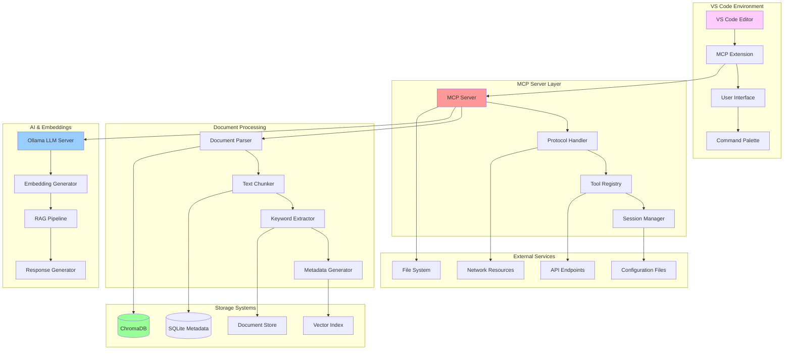
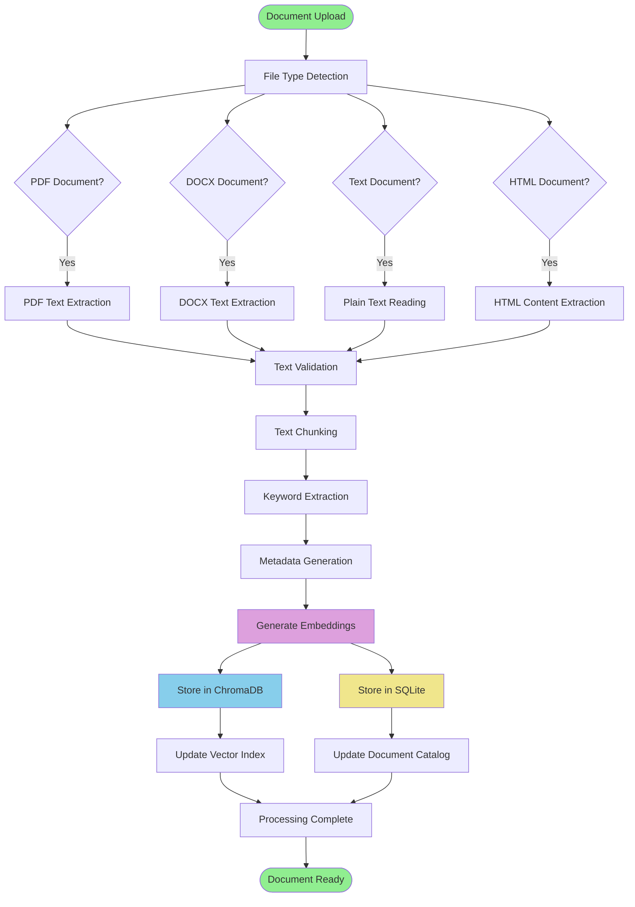
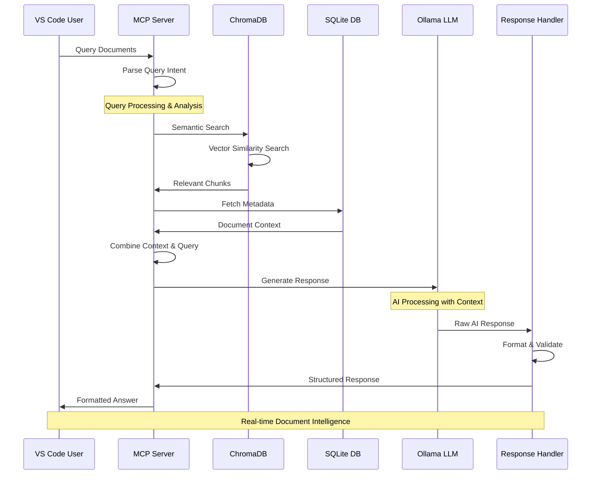
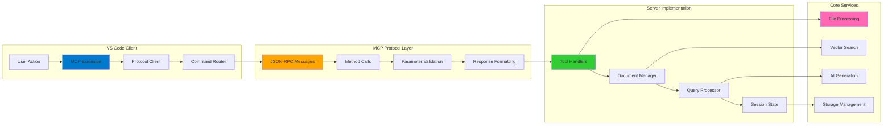
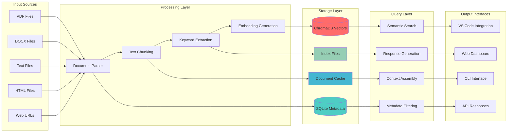
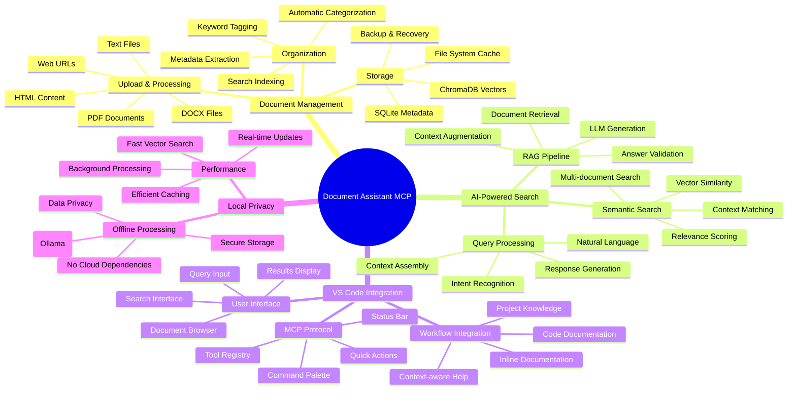

# Personal Document Assistant MCP Server 📚

> Intelligent document management and RAG capabilities for VS Code using Model Context Protocol

[](https://www.python.org/downloads/)
[](https://modelcontextprotocol.io/)
[](https://www.trychroma.com/)
[](https://ollama.ai/)
[](https://code.visualstudio.com/)

## Overview

A powerful Model Context Protocol (MCP) server that provides intelligent document management and RAG (Retrieval-Augmented Generation)##The server uses:
- **MCP Protocol** for VS Code integration
- **ChromaDB** for vector storage
- **SQLite** for metadata
- **Ollama** for local LLM
- **Python 3.13+** runtime

## � Deployment Suggestions

### Option 1: Local Development Server
- Keep running locally as an MCP server for VS Code
- Best for personal document management and development

### Option 2: Network Deployment
- Deploy on a local server accessible across your network
- Great for team document management within an organization

### Option 3: Cloud Adaptation
- Adapt for cloud deployment with managed vector databases
- **Pinecone** or **Weaviate** instead of local ChromaDB
- **OpenAI API** instead of local Ollama
- Deploy on **AWS**, **Google Cloud**, or **Azure**

### Option 4: Streamlit Interface
- Create a Streamlit web interface for document management
- Deploy on [Streamlit Cloud](https://streamlit.io/cloud)
- **Note**: Would require creating a web-based version of the MCP tools

## �👨‍💻 Author & Licenseuthor & License

All code and content in this repository is for educational and personal use.

**Somesh Ramesh Ghaturle**  
MS in Data Science, Pace University

📧 **Email:** [someshghaturle@gmail.com](mailto:someshghaturle@gmail.com)  
🐙 **GitHub:** [https://github.com/somesh-ghaturle](https://github.com/somesh-ghaturle)  
💼 **LinkedIn:** [https://www.linkedin.com/in/someshghaturle/](https://www.linkedin.com/in/someshghaturle/)ilities for VS Code. This system enables seamless integration of document processing, semantic search, and AI-powered question answering directly within your development environment.

## 📚 Table of Contents

- [🏗️ System Architecture](#️-system-architecture)
- [🔄 Document Processing Pipeline](#-document-processing-pipeline)
- [🧠 RAG Workflow](#-rag-workflow)
- [🔌 MCP Integration Flow](#-mcp-integration-flow)
- [📊 Data Flow Architecture](#-data-flow-architecture)
- [📁 Project Structure](#-project-structure)
- [🎯 Features & Tools](#-features--tools)
- [⚙️ Setup & Configuration](#️-setup--configuration)

## 🏗️ System Architecture



## 🔄 Document Processing Pipeline



## 🧠 RAG Workflow



## 🔌 MCP Integration Flow



## 📊 Data Flow Architecture



## 📁 Project Structure

```bash
Personal-Document-Assistant-MCP/
│
├── 📋 Configuration & Setup
│   ├── README.md                           # This comprehensive documentation
│   ├── requirements.txt                    # Python dependencies
│   ├── setup.sh                           # Automated setup script
│   ├── run.sh                             # Server startup script
│   └── .gitignore                         # Git exclusion rules
│
├── ⚙️ Configuration
│   └── config/
│       ├── settings.yaml                  # Server configuration
│       ├── logging.yaml                   # Logging configuration
│       └── tools.yaml                     # MCP tools definition
│
├── 🚀 Core Application
│   └── src/
│       ├── server.py                      # Main MCP server
│       ├── test_server.py                 # Component testing
│       ├── demo.py                        # Interactive demonstration
│       └── main.py                        # Entry point
│
├── 📄 Document Processing
│   └── src/processing/
│       ├── __init__.py
│       ├── document_parser.py             # Multi-format document parsing
│       ├── text_chunker.py               # Intelligent text segmentation
│       ├── keyword_extractor.py          # Automatic keyword extraction
│       └── metadata_generator.py         # Document metadata creation
│
├── 🧠 RAG Pipeline
│   └── src/rag/
│       ├── __init__.py
│       ├── retrieval.py                  # Document retrieval logic
│       ├── augmentation.py               # Context augmentation
│       ├── generation.py                 # Response generation
│       └── pipeline.py                   # End-to-end RAG workflow
│
├── 💾 Storage Systems
│   └── src/storage/
│       ├── __init__.py
│       ├── vector_store.py               # ChromaDB vector operations
│       ├── metadata_store.py             # SQLite metadata management
│       ├── document_store.py             # Document file management
│       └── cache_manager.py              # Intelligent caching system
│
├── 🔌 MCP Integration
│   └── src/mcp/
│       ├── __init__.py
│       ├── protocol_handler.py           # MCP protocol implementation
│       ├── tool_registry.py              # Available tools registration
│       ├── session_manager.py            # Session state management
│       └── response_formatter.py         # Response formatting utilities
│
├── 📊 Data & Logs
│   ├── data/                             # Document storage
│   │   ├── documents/                    # Uploaded documents
│   │   ├── vectors/                      # ChromaDB vector database
│   │   ├── metadata/                     # SQLite database files
│   │   └── cache/                        # Temporary cache files
│   │
│   └── logs/                             # System logs
│       ├── server.log                    # Main server logs
│       ├── processing.log                # Document processing logs
│       ├── rag.log                       # RAG pipeline logs
│       └── errors.log                    # Error tracking
│
└── 🔧 Development Tools
    ├── venv/                             # Virtual environment
    ├── tests/                            # Unit and integration tests
    ├── scripts/                          # Utility scripts
    └── docs/                             # Additional documentation
```

## 🎯 Features & Tools



## ⚙️ Setup & Configuration

### Prerequisites

- Python 3.13+ with pip
- VS Code with MCP extension
- Ollama for local LLM processing
- Git for version control

### Quick Start Guide

1. **Clone and Setup**

   ```bash
   git clone https://github.com/somesh-ghaturle/Projects.git
   cd "Projects/Personal-Document-Assistant-MCP"
   
   # Run automated setup
   ./setup.sh
   ```

2. **Start Ollama Service**

   ```bash
   # Start Ollama server
   ollama serve
   
   # In another terminal, pull required model
   ollama pull llama3
   ```

3. **Test the Server**

   ```bash
   # Test all components
   cd src && python test_server.py
   ```

4. **Interactive Demo**

   ```bash
   # Experience all features
   cd src && python demo.py
   ```

5. **VS Code Integration**

   Add to your VS Code `settings.json`:
   
   ```json
   {
     "mcp.servers": {
       "document-assistant": {
         "command": "python",
         "args": ["src/server.py"],
         "cwd": "/path/to/Personal-Document-Assistant-MCP"
       }
     }
   }
   ```

### Available MCP Tools

Once integrated with VS Code, these tools become available:

#### Document Management
- **`upload_document`** - Upload and process new documents
- **`list_documents`** - Browse your document library
- **`get_document_info`** - View detailed document metadata
- **`delete_document`** - Remove documents from the system

#### Intelligent Search & Query
- **`query_documents`** - Ask questions about your documents
- **`search_documents`** - Find relevant content across documents
- **`semantic_search`** - Advanced vector-based search
- **`contextual_lookup`** - Context-aware information retrieval

#### System Management
- **`get_system_stats`** - Monitor performance and usage
- **`clear_cache`** - Clean temporary files
- **`rebuild_index`** - Refresh search indices
- **`export_data`** - Backup your document database

### Interactive Demo Experience

The interactive demo showcases all system capabilities:

```bash
cd src && python demo.py
```

**Demo Features:**
- 📄 **Document Processing** - See text chunking and keyword extraction in action
- 💾 **Storage Systems** - Watch ChromaDB and SQLite initialization
- 🦙 **Ollama Integration** - Experience live AI responses using llama3
- 🚀 **Complete Workflow** - End-to-end document processing simulation

**Sample Demo Output:**
```
🎉 Personal Document Assistant - Interactive Demo
📄 Processing sample document...
✅ Created 5 text chunks from document
✅ Extracted keywords: machine, learning, artificial, intelligence, algorithms
💾 Vector store initialized with 512-dim embeddings
💾 Document metadata stored in SQLite database
🤖 AI Response: Machine learning is a subset of artificial intelligence that enables...
🚀 Complete workflow demonstration finished successfully!
```

### Troubleshooting

#### Ollama Connection Issues
```bash
# Check Ollama status
curl http://localhost:11434/api/tags

# Restart Ollama if needed
ollama serve
```

#### Component Testing
```bash
cd src
python test_server.py
```

#### Dependency Issues
```bash
# Reinstall all dependencies
./setup.sh
```

#### VS Code Integration Problems
```bash
# Verify MCP extension is installed
# Check settings.json configuration
# Restart VS Code
```

### Development & Customization

The server architecture supports easy customization:

#### Custom Document Processors
```python
# Add support for new file formats
class CustomProcessor(BaseProcessor):
    def process(self, file_path):
        # Your custom processing logic
        return processed_text
```

#### Custom RAG Pipeline
```python
# Customize the retrieval and generation process
class CustomRAGPipeline(RAGPipeline):
    def retrieve(self, query):
        # Custom retrieval logic
        return relevant_documents
```

#### Custom MCP Tools
```python
# Add new VS Code tools
@mcp_tool("custom_analysis")
async def custom_analysis(params):
    # Your custom functionality
    return analysis_results
```

## 📄 License

MIT License - Open source for educational and research purposes.

---

Built with 🧠 using MCP Protocol, ChromaDB, Ollama, and Python

## 🚀 Quick Start

### 1. Setup
```bash
# Run the setup script
./setup.sh
```

### 2. Start Ollama (if not running)
```bash
# Start Ollama server
ollama serve

# In another terminal, ensure you have llama3
ollama pull llama3
```

### 3. Test the Server
```bash
# Test all components
cd src && python test_server.py
```

### 4. Try the Interactive Demo
```bash
# Run the interactive demo to see all features in action
cd src && python demo.py
```

### 5. VS Code Integration

1. **Install MCP Extension** in VS Code marketplace

2. **Add to your VS Code settings.json**:
```json
{
  "mcp.servers": {
    "document-assistant": {
      "command": "python",
      "args": ["src/server.py"],
      "cwd": "/path/to/Personal-Document-Assistant-MCP"
    }
  }
}
```

## 🛠️ Features

- **Document Processing**: PDF, DOCX, TXT, HTML support
- **Semantic Search**: ChromaDB vector embeddings
- **RAG Q&A**: Question answering with document context
- **Local LLM**: Uses Ollama (privacy-first)
- **MCP Integration**: Native VS Code integration

## 📁 Project Structure

```
Personal-Document-Assistant-MCP/
├── config/
│   └── settings.yaml          # Server configuration
├── src/
│   ├── processing/            # Document processing
│   ├── rag/                   # RAG pipeline
│   ├── storage/               # Vector & document storage
│   ├── server.py              # MCP server
│   ├── test_server.py         # Component tests
│   └── demo.py                # Interactive demo
├── requirements.txt           # Python dependencies
├── setup.sh                   # Setup script
└── run.sh                     # Start script
```

## 🔧 Available Tools in VS Code

Once integrated, these tools will be available:

- **upload_document** - Upload and process documents
- **query_documents** - Ask questions about documents
- **search_documents** - Find relevant content
- **list_documents** - Browse document library
- **get_document_info** - View document metadata
- **delete_document** - Remove documents
- **get_system_stats** - Monitor system performance

## 🎮 Interactive Demo

Experience all features with the interactive demo:

```bash
cd src && python demo.py
```

**Demo Features:**
- 📄 **Document Processing** - See text chunking and keyword extraction
- 💾 **Storage Systems** - ChromaDB and SQLite initialization
- 🦙 **Ollama Chat** - Live AI responses using llama3
- 🚀 **Workflow Simulation** - Complete end-to-end process overview

**Sample Demo Output:**
```
🎉 Personal Document Assistant - Interactive Demo
✅ Created 1 text chunks
✅ Keywords: learning, artificial, intelligence, systems
✅ Vector store ready for embeddings
✅ Document store ready for metadata
🤖 Answer: Artificial Intelligence (AI) refers to the development of computer systems...
```

## 🐛 Troubleshooting

### Ollama Not Running
```bash
# Check if Ollama is running
curl http://localhost:11434/api/tags

# Start Ollama if needed
ollama serve
```

### Component Test
```bash
cd src
python test_server.py
```

### Interactive Demo
```bash
cd src
python demo.py
```

### Dependencies
```bash
# Reinstall dependencies
./setup.sh
```

## 💻 Development

The server uses:
- **MCP Protocol** for VS Code integration
- **ChromaDB** for vector storage
- **SQLite** for metadata
- **Ollama** for local LLM
- **Python 3.13+** runtime

## �‍💻 Author & License

All code and content in this repository is for educational and personal use.

**Somesh Ramesh Ghaturle**  
MS in Data Science, Pace University
