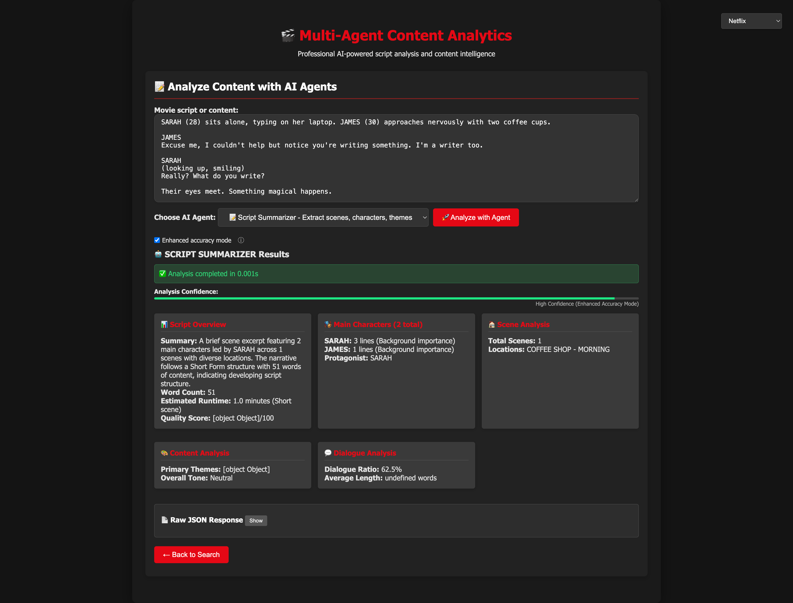

# 🚀 AI & Data Science Projects Portfolio

> **Professional AI/ML Projects Collection** | *Advanced Multi-Agent Systems, Financial Analytics, and Data Science Solutions*

This repository showcases a comprehensive collection of production-ready AI and data science projects developed during my Master's degree in Data Science at Pace University. Each project demonstrates expertise in modern AI frameworks, financial technologies, and scalable system architecture.

## 🎯 Portfolio Overview

A curated selection of **5 professional AI/ML projects** spanning financial analytics, multi-agent systems, content analysis, research automation, and algorithmic trading. All projects feature production deployment capabilities, comprehensive documentation, and modern tech stacks.

## 📁 Project Structure

```text
Projects/
├── 🏦 agentic-finance-workflow/                    # AI Financial Analytics Platform
├── 🔬 AgenTech Research Hub/                       # Multi-Agent AI Research System
├── 📊 AI Data Analytics Agent/                     # Streamlit + Ollama Analytics Tool
├── 🎭 Multi-Agent-Content-Analytics/              # AI Content Analysis Platform
├── 📈 Microsoft Stock Price Prediction Workflow/  # n8n Trading Automation
└── 📖 README.md                                   # Portfolio Documentation
```

## 🏗️ Portfolio Architecture

```mermaid
flowchart TB
    subgraph "🤖 AI & Financial Analytics"
        FINANCE[🏦 Agentic Finance Workflow<br/>Financial Analysis Platform<br/>Chart.js + Multi-Agent System]
        RESEARCH[🔬 AgenTech Research Hub<br/>Multi-Agent AI Research<br/>CrewAI + LangGraph + AutoGen]
        ANALYTICS[📊 AI Data Analytics Agent<br/>Streamlit + Ollama LLM<br/>Local Data Analysis Platform]
        CONTENT[🎭 Multi-Agent Content Analytics<br/>Movie Script Analysis<br/>NLP + Marketing Intelligence]
    end
    
    subgraph "� Trading & Automation"
        TRADING[📈 Stock Price Prediction<br/>n8n Workflow Automation<br/>LSTM/GRU + Discord Alerts]
    end
    
    subgraph "🛠️ Technology Stack"
        AI_TECH[🤖 AI Technologies<br/>CrewAI, LangGraph, AutoGen<br/>Ollama LLM, FastAPI]
        WEB_TECH[🌐 Web Technologies<br/>Chart.js, HTML5, CSS3<br/>Responsive Design, REST APIs]
        DATA_TECH[📊 Data Technologies<br/>Pandas, NumPy, Plotly<br/>Streamlit, Docker, nginx]
        WORKFLOW_TECH[🔄 Automation Technologies<br/>n8n, Yahoo Finance API<br/>Discord Integration, LSTM/GRU]
    end
    
    %% Project Connections
    FINANCE --> AI_TECH
    FINANCE --> WEB_TECH
    RESEARCH --> AI_TECH
    ANALYTICS --> AI_TECH
    ANALYTICS --> DATA_TECH
    CONTENT --> AI_TECH
    CONTENT --> DATA_TECH
    
    TRADING --> WORKFLOW_TECH
    
    %% Styling
    style FINANCE fill:#e8f5e8
    style RESEARCH fill:#e3f2fd
    style ANALYTICS fill:#f3e5f5
    style CONTENT fill:#fff3e0
    style TRADING fill:#f1f8e9
```



## 🌟 Featured Projects

### 🏦 Agentic Finance Workflow
> **AI-Powered Financial Analytics Platform with Real-time Visualizations**


An advanced financial analysis platform featuring multi-agent AI systems, real-time Chart.js visualizations, and comprehensive portfolio analytics. Built with FastAPI, nginx, and production Docker deployment.

**Key Features:**
- Real-time financial data visualization with Chart.js v3.9.1
- Multi-agent AI system for market analysis and insights
- Production-ready Docker deployment with nginx reverse proxy
- Comprehensive REST API for financial data processing
- Advanced portfolio optimization and risk assessment tools

**Tech Stack:** `FastAPI` `Chart.js` `Docker` `nginx` `Multi-Agent AI` `Financial APIs`

---

### 🔬 AgenTech Research Hub
> **Multi-Agent AI Research System with Dynamic Topic Detection**


Advanced multi-agent AI research system leveraging CrewAI, LangGraph, and AutoGen frameworks for comprehensive research automation with intelligent topic detection and authoritative source gathering.

**Key Features:**
- Multi-agent architecture with CrewAI, LangGraph, and AutoGen integration
- Dynamic topic detection across 15+ research domains
- Real-time authoritative source gathering (WHO, NASA, IEEE, etc.)
- Three operating modes: Demo, Interactive, and REST API
- Production-ready with Prometheus monitoring and comprehensive logging

**Tech Stack:** `CrewAI` `LangGraph` `AutoGen` `FastAPI` `Prometheus` `Docker`

---

### 📊 AI Data Analytics Agent
> **Local LLM-Powered Analytics Platform with Ollama Integration**


Intelligent data analytics tool combining local Large Language Models via Ollama with intuitive Streamlit interface for privacy-first data analysis without cloud dependencies.

**Key Features:**
- Multi-format data support (CSV, Excel, JSON)
- Local LLM integration with Ollama (Llama3, Mistral, etc.)
- Comprehensive analytics suite with predictive modeling
- Interactive Streamlit dashboard with data visualization
- Privacy-first approach with local processing

**Tech Stack:** `Streamlit` `Ollama` `LLM` `Pandas` `NumPy` `Docker`

---

### 🎭 Multi-Agent Content Analytics
> **AI-Powered Movie Script Analysis for Entertainment Industry**



Sophisticated AI-powered content analysis platform designed for movie scripts and entertainment industry analytics, featuring specialized NLP agents and marketing intelligence capabilities.

**Key Features:**
- Multi-agent content analysis system for movie scripts
- Specialized NLP agents for entertainment industry insights
- Marketing intelligence and audience targeting recommendations
- Production-ready deployment with comprehensive monitoring
- Advanced content processing and sentiment analysis

**Tech Stack:** `FastAPI` `NLP` `Multi-Agent AI` `Docker` `nginx` `Content Analysis`

---

### 📈 Microsoft Stock Price Prediction Workflow
> **AI-Powered Trading Platform with n8n Workflow Automation**


Intelligent automated trading system combining real-time market data analysis with advanced AI decision-making. Built on n8n workflow automation with local Ollama LLM integration for sophisticated trading signals and email notifications.

**Key Features:**
- Real-time MSFT stock data processing from Yahoo Finance API
- Local Ollama AI integration for intelligent trading analysis
- Professional email notifications with trading recommendations
- Complete Docker containerization with health monitoring
- Visual n8n workflow editor for easy customization
- BUY/SELL/HOLD signals with risk assessment and price predictions

**Tech Stack:** `n8n` `Ollama AI` `Docker` `PostgreSQL` `Redis` `Yahoo Finance API` `Email Automation`

**Tech Stack:** `n8n` `LSTM/GRU` `Yahoo Finance API` `Discord` `Neural Networks`

## 🚀 Quick Start Guide

### Prerequisites
```bash
# Required installations
docker --version          # Docker for containerization
python3 --version         # Python 3.8+
node --version            # Node.js for web components
git --version             # Git for version control
```

### Running Projects

**Financial Analytics Platform:**
```bash
cd agentic-finance-workflow
./start_development.sh    # Development mode
./start_production.sh     # Production deployment
```

**AI Research Hub:**
```bash
cd "AgenTech Research Hub"
python3 src/main.py       # Interactive research system
python3 api_server.py     # REST API server
```

**Data Analytics Agent:**
```bash
cd "AI Data Analytics Agent"
streamlit run streamlit_app.py  # Launch analytics dashboard
```

**Content Analytics:**
```bash
cd Multi-Agent-Content-Analytics
python3 multi_agent_content_api.py  # Start content analysis API
```

**Stock Prediction Workflow:**
```bash
cd "Microsoft Stock Price Prediction Workflow (n8n)"
# Import trading-workflow.json into n8n platform
```

## 💼 Professional Applications

### � Financial Technology
- **Real-time Portfolio Analytics**: Advanced financial data visualization
- **Risk Assessment**: Multi-agent AI for market analysis and insights
- **Algorithmic Trading**: Automated trading signals with ML predictions

### 🔬 Research & Analytics
- **Academic Research**: Multi-agent system for comprehensive topic analysis
- **Data Science**: Local LLM-powered analytics with privacy protection
- **Content Intelligence**: AI-driven entertainment industry insights

### �️ Production Features
- **Docker Deployment**: All projects containerized for easy deployment
- **REST APIs**: Comprehensive API endpoints for integration
- **Monitoring**: Prometheus metrics and health checks
- **Security**: nginx reverse proxy and secure configurations

## � Technologies & Frameworks

### 🤖 AI & Machine Learning
- **Multi-Agent Frameworks**: CrewAI, LangGraph, AutoGen
- **Large Language Models**: Ollama (Llama3, Mistral)
- **Neural Networks**: LSTM/GRU for time series prediction
- **NLP Processing**: Advanced content analysis and sentiment detection

### � Web & API Development
- **Backend**: FastAPI, uvicorn, Python
- **Frontend**: Chart.js v3.9.1, HTML5, CSS3, JavaScript
- **API Integration**: Yahoo Finance, Discord webhooks
- **Data Visualization**: Interactive charts and real-time updates

### 🚀 DevOps & Deployment
- **Containerization**: Docker, docker-compose
- **Web Server**: nginx reverse proxy
- **Monitoring**: Prometheus metrics
- **Automation**: n8n workflow orchestration

### 📊 Data & Analytics
- **Data Processing**: Pandas, NumPy, Plotly
- **Databases**: ChromaDB for vector embeddings
- **File Formats**: CSV, Excel, JSON, PDF processing
- **Streaming**: Streamlit for interactive dashboards

## 👨‍💻 Author & License

All code and content in this repository is for educational and personal use.

**Somesh Ramesh Ghaturle**  
MS in Data Science, Pace University

📧 **Email:** [someshghaturle@gmail.com](mailto:someshghaturle@gmail.com)  
🐙 **GitHub:** [https://github.com/somesh-ghaturle](https://github.com/somesh-ghaturle)  
💼 **LinkedIn:** [https://www.linkedin.com/in/someshghaturle/](https://www.linkedin.com/in/someshghaturle/)

### 📄 MIT License

```text
MIT License

Copyright (c) 2025 Somesh Ramesh Ghaturle

Permission is hereby granted, free of charge, to any person obtaining a copy
of this software and associated documentation files (the "Software"), to deal
in the Software without restriction, including without limitation the rights
to use, copy, modify, merge, publish, distribute, sublicense, and/or sell
copies of the Software, and to permit persons to whom the Software is
furnished to do so, subject to the following conditions:

The above copyright notice and this permission notice shall be included in all
copies or substantial portions of the Software.

THE SOFTWARE IS PROVIDED "AS IS", WITHOUT WARRANTY OF ANY KIND, EXPRESS OR
IMPLIED, INCLUDING BUT NOT LIMITED TO THE WARRANTIES OF MERCHANTABILITY,
FITNESS FOR A PARTICULAR PURPOSE AND NONINFRINGEMENT. IN NO EVENT SHALL THE
AUTHORS OR COPYRIGHT HOLDERS BE LIABLE FOR ANY CLAIM, DAMAGES OR OTHER
LIABILITY, WHETHER IN AN ACTION OF CONTRACT, TORT OR OTHERWISE, ARISING FROM,
OUT OF OR IN CONNECTION WITH THE SOFTWARE OR THE USE OR OTHER DEALINGS IN THE
SOFTWARE.
```

---

### 🌟 Built with passion for AI, Data Science, and Financial Technology
