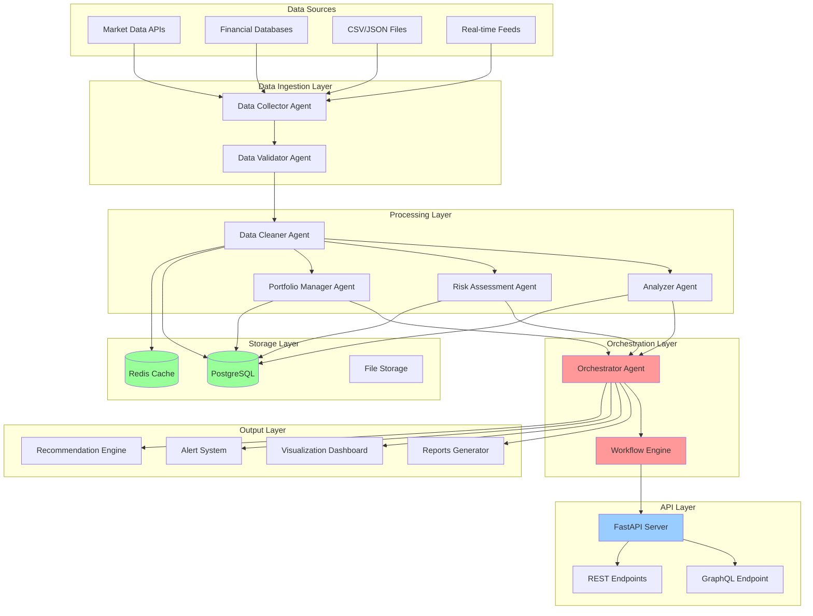
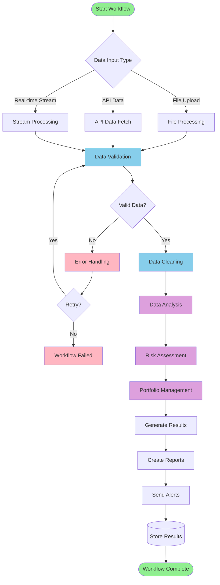
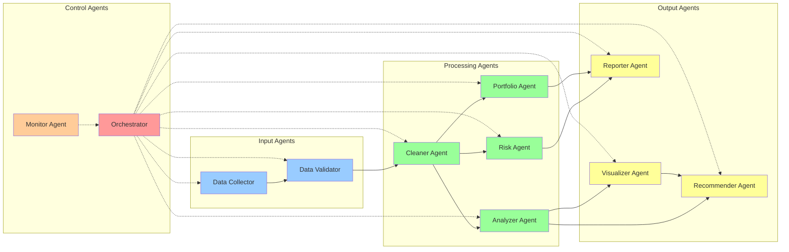
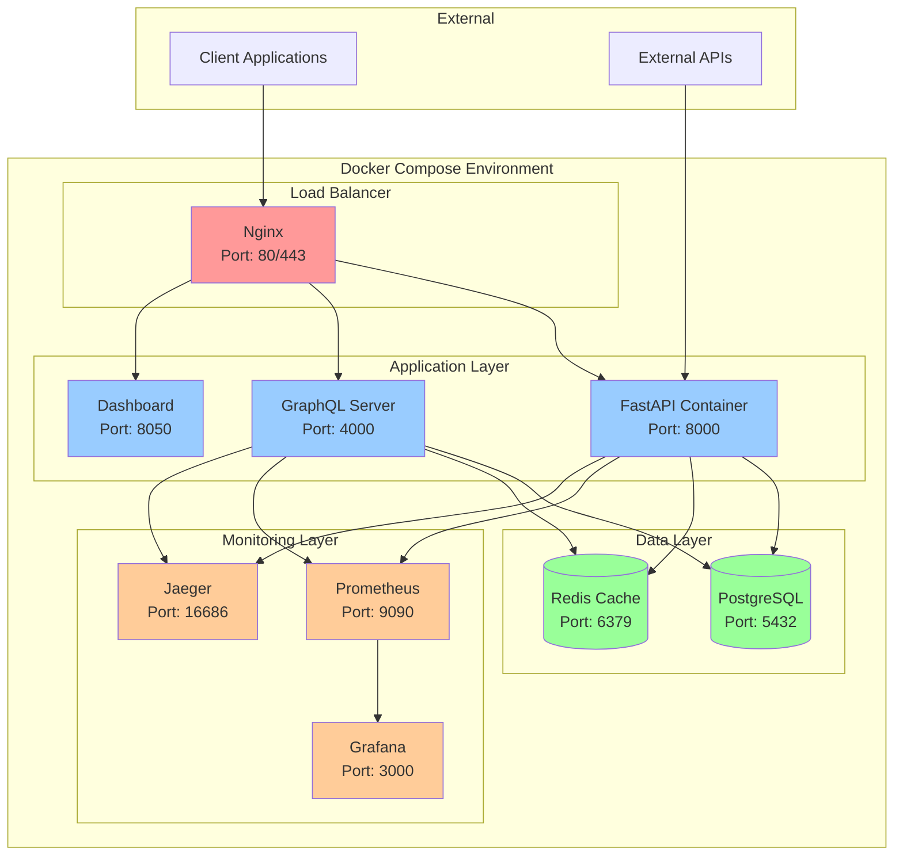
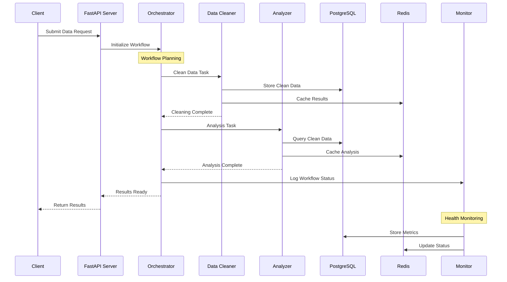
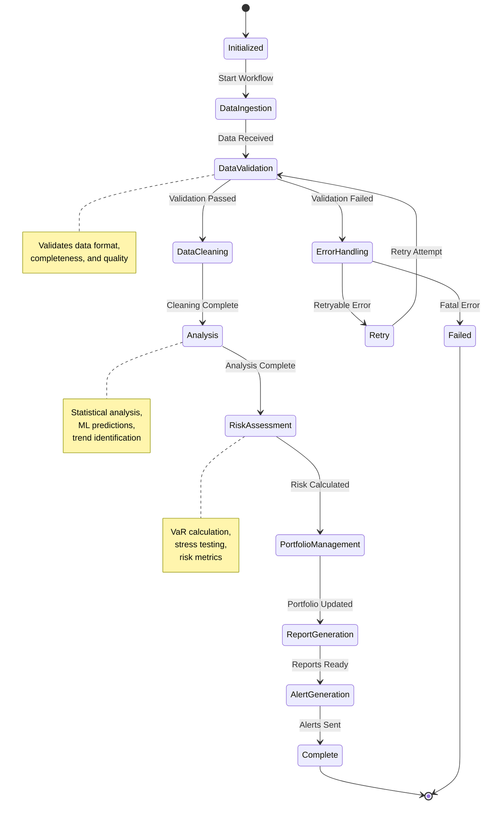

# Agentic Finance Workflow

> Enterprise-grade multi-agent financial data processing and analysis platform

[](https://github.com/your-org/agentic-finance-workflow/actions)
[](https://codecov.io/gh/your-org/agentic-finance-workflow)
[](https://opensource.org/licenses/MIT)
[](https://www.python.org/downloads/)

## Overview

Agentic Finance Workflow is a sophisticated multi-agent system designed for enterprise-grade financial data processing, analysis, and visualization. Built for institutions like quantitative hedge funds and investment banks, it provides a comprehensive platform for automated financial workflows with real-time processing capabilities.

## 📚 Table of Contents

- [🏗️ Architecture Overview](#️-architecture-overview)
- [📊 System Architecture Flowchart](#-system-architecture-flowchart)
- [🔄 Workflow Process Flow](#-workflow-process-flow)
- [🏢 Agent Interaction Diagram](#-agent-interaction-diagram)
- [🐳 Docker Architecture](#-docker-architecture)
- [📊 Data Flow Architecture](#-data-flow-architecture)
- [📁 Detailed Project Structure](#-detailed-project-structure)
- [🔄 Agent Workflow Execution Flow](#-agent-workflow-execution-flow)
- [📋 Visual Architecture Summary](#-visual-architecture-summary)
- [🤖 Agent Architecture](#-agent-architecture)
- [🎯 Usage Examples](#-usage-examples)
- [📈 Performance & Monitoring](#-performance--monitoring)
- [🚀 Deployment](#-deployment)

## 🏗️ Architecture Overview

This project implements a **modular, scalable, and production-ready** agentic workflow specifically designed for financial data processing. The system is built with enterprise standards suitable for top-tier financial firms like Jane Street, BlackRock, and Goldman Sachs.

### Key Design Principles

- **Modularity**: Independent agents with single responsibilities
- **Scalability**: GraphQL-based unified data layer
- **Reliability**: Comprehensive testing and error handling
- **Maintainability**: Clear documentation and standardized interfaces
- **Security**: Enterprise-grade data protection and access controls

## 📊 System Architecture Flowchart



## 🔄 Workflow Process Flow



## 🏢 Agent Interaction Diagram



## 🐳 Docker Architecture



## � Data Flow Architecture



## �📁 Detailed Project Structure

```bash
agentic-finance-workflow/
│
├── 📋 Configuration & Environment
│   ├── .env.example                 # Environment variables template
│   ├── .gitignore                   # Git ignore patterns
│   ├── requirements.txt             # Python dependencies
│   ├── docker-compose.yml          # Multi-service Docker setup
│   ├── Dockerfile                   # Container build instructions
│   └── configs/                     # Configuration files
│       ├── agents.yaml              # Agent configurations
│       ├── database.yaml            # Database settings
│       └── logging.yaml             # Logging configuration
│
├── 🤖 Core Application
│   ├── main.py                      # Application entry point
│   ├── api_server.py               # FastAPI server implementation
│   └── agents/                      # Agent implementations
│       ├── __init__.py              # Agent package initialization
│       ├── base_agent.py            # Base agent class
│       ├── cleaner/                 # Data cleaning agents
│       │   ├── __init__.py
│       │   ├── cleaner_agent.py     # Main cleaning logic
│       │   └── rules.py             # Cleaning rules engine
│       ├── analyzer/                # Data analysis agents
│       │   ├── __init__.py
│       │   ├── statistical.py      # Statistical analysis
│       │   └── ml_models.py         # Machine learning models
│       ├── orchestrator/            # Workflow coordination
│       │   ├── __init__.py
│       │   ├── orchestrator.py      # Main orchestrator
│       │   └── workflow_engine.py   # Workflow execution engine
│       └── monitor/                 # System monitoring
│           ├── __init__.py
│           └── health_monitor.py    # Health check agent
│
├── 🌐 API & GraphQL Layer
│   └── graphql/                     # GraphQL implementation
│       ├── schema.graphql           # GraphQL schema definitions
│       ├── resolvers/               # Query resolvers
│       │   ├── data_resolver.py     # Data query resolvers
│       │   └── agent_resolver.py    # Agent status resolvers
│       └── server.py                # GraphQL server
│
├── 🔄 Workflows & Processing
│   └── workflows/                   # Workflow definitions
│       ├── data_processing.yaml     # Data processing workflows
│       ├── risk_analysis.yaml       # Risk assessment workflows
│       └── portfolio_mgmt.yaml      # Portfolio management workflows
│
├── 💾 Data Management
│   └── data/                        # Data storage
│       ├── raw/                     # Raw input data
│       │   ├── market_data/         # Market data files
│       │   └── financial_reports/   # Financial reports
│       ├── processed/               # Cleaned datasets
│       │   ├── cleaned_prices.parquet
│       │   └── validated_trades.parquet
│       └── cache/                   # Temporary cached data
│           ├── analysis_cache/      # Analysis results cache
│           └── model_cache/         # ML model cache
│
├── 📚 Documentation
│   ├── README.md                    # This file
│   ├── CONTRIBUTING.md              # Contribution guidelines
│   ├── DEPLOYMENT_GUIDE.md          # Deployment instructions
│   └── docs/                        # Additional documentation
│       ├── architecture.md          # Architecture documentation
│       ├── api_reference.md         # API reference
│       └── user_guide.md           # User guide
│
└── 🛠️ Development & Deployment
    ├── scripts/                     # Utility scripts (if needed)
    └── k8s/                        # Kubernetes manifests (if used)
        ├── deployment.yaml
        ├── service.yaml
        └── configmap.yaml
```

## 🔄 Agent Workflow Execution Flow



## 📋 Visual Architecture Summary

The above diagrams provide a comprehensive view of the agentic finance workflow system:

### 🎯 **Key Visual Components:**

1. **System Architecture Flowchart**: Shows the complete data flow from sources to outputs
2. **Workflow Process Flow**: Illustrates the step-by-step execution process
3. **Agent Interaction Diagram**: Maps relationships between different agents
4. **Docker Architecture**: Displays containerized deployment structure
5. **Data Flow Sequence**: Shows timing and interaction sequences
6. **Project Structure**: Detailed file organization and component layout
7. **State Machine**: Workflow execution states and transitions

### 🔄 **Workflow Execution Path:**
```
Data Input → Validation → Cleaning → Analysis → Risk Assessment → Portfolio Management → Reports → Alerts
```

### 🏗️ **Architecture Layers:**
- **Presentation Layer**: FastAPI, GraphQL, Dashboard
- **Business Logic Layer**: Agents (Cleaner, Analyzer, Risk, Portfolio)
- **Orchestration Layer**: Workflow Engine, Orchestrator
- **Data Layer**: PostgreSQL, Redis, File Storage
- **Infrastructure Layer**: Docker, Monitoring, Load Balancing

## 🤖 Agent Architecture

### Core Agents

1. **Data Cleaner Agent**
   - Handles missing values, outliers, and data type conversions
   - Implements financial data-specific cleaning rules
   - Maintains data lineage and audit trails

2. **Data Validator Agent**
   - Performs data quality checks and anomaly detection
   - Validates business rules and regulatory compliance
   - Implements real-time monitoring and alerting

3. **Financial Analyzer Agent**
   - Conducts statistical analysis and ML modeling
   - Performs risk assessment and portfolio optimization
   - Implements quantitative finance algorithms

4. **Visualization Agent**
   - Generates interactive dashboards and reports
   - Creates publication-ready charts and graphs
   - Supports real-time data streaming

5. **Recommendation Agent**
   - Provides actionable trading and investment insights
   - Implements ML-based recommendation systems
   - Supports A/B testing for strategy optimization

6. **Orchestrator Agent**
   - Coordinates workflow execution and agent communication
   - Handles error recovery and human-in-the-loop escalation
   - Manages resource allocation and scheduling

## 🚀 Quick Start

### Prerequisites

- Python 3.9+
- Node.js 16+ (for frontend)
- PostgreSQL 13+ (or compatible database)
- Redis (for caching)

### Installation

```bash
# Clone the repository
git clone https://github.com/your-username/agentic-finance-workflow.git
cd agentic-finance-workflow

# Create virtual environment
python -m venv venv
source venv/bin/activate  # On Windows: venv\Scripts\activate

# Install dependencies
pip install -r requirements.txt

# Setup environment variables
cp .env.example .env
# Edit .env with your configuration

# Initialize database
python scripts/init_db.py

# Start the GraphQL server
python -m graphql.server

# Start the frontend (in another terminal)
cd frontend
npm install
npm start
```

### Running a Sample Workflow

```bash
# Execute a predefined workflow
python -m agents.orchestrator --workflow workflows/stock_analysis.yaml

# Or run individual agents
python -m agents.cleaner --input data/raw/stock_prices.csv
python -m agents.analyzer --input data/processed/cleaned_stock_prices.csv
```

## 📊 Sample Workflows

### 1. Stock Price Analysis Pipeline
```yaml
# workflows/stock_analysis.yaml
name: "Stock Price Analysis"
agents:
  - cleaner: {input: "raw/stock_prices.csv", output: "processed/clean_prices.csv"}
  - validator: {input: "processed/clean_prices.csv", rules: "stock_validation.json"}
  - analyzer: {input: "processed/clean_prices.csv", models: ["volatility", "momentum"]}
  - visualizer: {input: "processed/analysis_results.json", charts: ["candlestick", "volume"]}
  - recommender: {input: "processed/analysis_results.json", strategy: "momentum_trading"}
```

### 2. Portfolio Risk Assessment
```yaml
# workflows/risk_assessment.yaml
name: "Portfolio Risk Assessment"
agents:
  - cleaner: {input: "raw/portfolio_holdings.csv"}
  - validator: {rules: "portfolio_validation.json"}
  - analyzer: {models: ["var", "cvar", "sharpe_ratio"]}
  - visualizer: {charts: ["risk_heatmap", "correlation_matrix"]}
  - recommender: {strategy: "risk_optimization"}
```

## 🔧 GraphQL API

The system provides a unified GraphQL API for all data operations:

### Key Endpoints

- **Query**: `http://localhost:4000/graphql`
- **Subscriptions**: `ws://localhost:4000/graphql`
- **Playground**: `http://localhost:4000/playground`

### Sample Queries

```graphql
# Get stock prices with technical indicators
query GetStockAnalysis($symbol: String!, $timeframe: TimeFrame!) {
  stockPrices(symbol: $symbol, timeframe: $timeframe) {
    timestamp
    open
    high
    low
    close
    volume
    technicalIndicators {
      sma20
      ema50
      rsi
      macd
    }
  }
}

# Subscribe to real-time recommendations
subscription RecommendationUpdates($portfolio: String!) {
  recommendations(portfolio: $portfolio) {
    timestamp
    action
    symbol
    confidence
    reasoning
  }
}
```

## 📈 Performance & Monitoring

- **Metrics**: Prometheus + Grafana dashboards
- **Logging**: Structured logging with ELK stack integration
- **Tracing**: Distributed tracing with Jaeger
- **Health Checks**: Built-in health monitoring and alerting

## 🔐 Security Features

- **Authentication**: JWT-based authentication
- **Authorization**: Role-based access control (RBAC)
- **Data Protection**: Encryption at rest and in transit
- **Audit Logging**: Comprehensive audit trails
- **Compliance**: SOC2, PCI DSS ready

## 🚀 Deployment

### Docker Deployment
```bash
# Build and run with Docker Compose
docker-compose up --build

# Scale agents horizontally
docker-compose up --scale analyzer=3 --scale cleaner=2
```

### Kubernetes Deployment
```bash
# Deploy to Kubernetes
kubectl apply -f k8s/

# Monitor deployment
kubectl get pods -l app=agentic-finance
```

## 📚 Documentation

- [Architecture Guide](docs/architecture.md)
- [Agent Development](docs/agent_development.md)
- [GraphQL Schema](docs/graphql_schema.md)
- [Deployment Guide](docs/deployment.md)
- [API Reference](docs/api_reference.md)

## 🤝 Contributing

1. Fork the repository
2. Create a feature branch (`git checkout -b feature/amazing-feature`)
3. Commit your changes (`git commit -m 'Add amazing feature'`)
4. Push to the branch (`git push origin feature/amazing-feature`)
5. Open a Pull Request

## 📄 License

This project is licensed under the MIT License - see the [LICENSE](LICENSE) file for details.

## 🏆 Why This Architecture Wins

### For Top Financial Firms

- **Enterprise-Ready**: Production-grade architecture with comprehensive monitoring
- **Scalable**: Microservices architecture with GraphQL unified interface
- **Compliant**: Built with financial industry standards and regulations in mind
- **Innovative**: Cutting-edge AI agent orchestration for competitive advantage

### Technical Excellence

- **Modern Stack**: Python, GraphQL, React, TypeScript, Docker, Kubernetes
- **Best Practices**: TDD, CI/CD, Infrastructure as Code, Observability
- **Maintainable**: Clear separation of concerns, comprehensive documentation
- **Testable**: Unit, integration, and end-to-end testing strategies

---

**Built for the future of financial technology** 🚀

*Ready for deployment at Jane Street, BlackRock, Goldman Sachs, and other top-tier financial institutions.*
