# 🚀 Agentic Finance Workflow

A sophisticated multi-agent financial analysis platform that provides professional-grade investment analytics, real-time market data integration, and interactive financial visualizations.


## 📱 App Preview


## ✨ Key Features

### 🔥 Core Capabilities
- **Multi-Agent Architecture**: Sophisticated agent coordination for financial analysis
- **Real-Time Market Data**: Integration with Yahoo Finance for live market feeds
- **Professional Visualizations**: 6 interactive chart types powered by Chart.js v3.9.1
- **Risk Analysis**: Comprehensive risk metrics and portfolio optimization
- **Predictive Analytics**: ML-powered price predictions and trend analysis
- **Production-Ready**: Docker containerization with nginx reverse proxy

### 📈 Financial Analytics
1. **Candlestick Charts** - OHLC price visualization with volume indicators
2. **Technical Analysis** - RSI, MACD, Bollinger Bands, and moving averages
3. **Portfolio Analytics** - Asset allocation and performance tracking
4. **Risk Metrics** - VaR, Sharpe ratio, and volatility analysis
5. **Market Sentiment** - Fear & Greed index and sentiment scoring
6. **Performance Dashboard** - YTD returns, benchmarking, and attribution

### 🏗️ Technical Stack
- **Backend**: FastAPI with async support
- **Frontend**: Professional HTML5/CSS3/JavaScript interface
- **Charts**: Chart.js v3.9.1 (standalone version - 401,474 bytes)
- **Data Sources**: Yahoo Finance, Alpha Vantage (optional)
- **Deployment**: Docker Compose with nginx load balancing
- **Architecture**: Microservices with health monitoring

## 🚀 Quick Start Guide

### Prerequisites
- Docker and Docker Compose installed
- Port 8080 available on your system
- Internet connection for market data

### Step 1: Start the Application
```bash
# Navigate to project directory
cd agentic-finance-workflow

# Start the production environment
docker-compose -f docker-compose.production.yml up -d
```

### Step 2: Access the Dashboard
Open your browser and navigate to:
```
http://localhost:8080
```

You should see the professional financial dashboard with:
- ✅ Chart.js v3.9.1 loading confirmation (green banner)
- 📊 Six interactive chart types with real AAPL data
- 🔄 Multi-agent system status indicators
- 💹 Real-time financial analytics

### Step 3: Verify System Health
```bash
curl http://localhost:8080/health
```

Expected response:
```json
{
  "status": "healthy",
  "service": "Agentic Finance Workflow",
  "version": "2.0.0",
  "uptime": 123.45,
  "agents": {
    "data_cleaner": "active",
    "risk_analysis": "active",
    "prediction": "active",
    "data_generator": "active",
    "real_data_fetcher": "yahoo_finance"
  }
}
```

## 🔧 API Documentation

### Core Endpoints

#### Health Check
```bash
GET /health
```
Returns system health status and agent availability.

#### Chart.js Library (Local Serving)
```bash
GET /chart.min.js
```
Serves Chart.js v3.9.1 standalone version (401,474 bytes) for reliable chart rendering.

#### Main Dashboard
```bash
GET /
```
Returns the professional financial dashboard interface.

### Financial Analysis APIs

#### Stock Analysis
```bash
POST /analyze
Content-Type: application/json

{
  "symbol": "AAPL"
}
```

Response includes:
- Real-time OHLCV data from Yahoo Finance
- Technical indicators (RSI, MACD, Bollinger Bands)
- Risk metrics (volatility, VaR)
- Multi-agent analysis results

#### Price Prediction
```bash
POST /predict
Content-Type: application/json

{
  "symbol": "AAPL",
  "days": 30
}
```

Response includes:
- 30-day price forecasts
- Confidence intervals
- ML model predictions
- Historical accuracy metrics

#### Multi-Agent Workflow
```bash
POST /workflow
Content-Type: application/json

{
  "symbol": "AAPL",
  "analysis_type": "comprehensive"
}
```

Executes coordinated multi-agent analysis workflow with all four agents.

## 🏗️ System Architecture

```
┌─────────────────┐    ┌─────────────────┐    ┌─────────────────┐
│   nginx Proxy   │────│  FastAPI Server │────│   Yahoo Finance │
│   Port 8080     │    │   Port 8001     │    │   Market Data   │
└─────────────────┘    └─────────────────┘    └─────────────────┘
         │                       │                       │
         │              ┌─────────────────┐              │
         │              │  Chart.js v3.9.1│              │
         │              │ (401,474 bytes) │              │
         │              └─────────────────┘              │
         │                       │                       │
    ┌─────────────────────────────────────────────────────────┐
    │                Multi-Agent System                      │
    │  ┌─────────────┐ ┌─────────────┐ ┌─────────────┐      │
    │  │Data Cleaner │ │Risk Analysis│ │ Prediction  │      │
    │  │   Agent     │ │   Agent     │ │   Agent     │      │
    │  └─────────────┘ └─────────────┘ └─────────────┘      │
    │                ┌─────────────┐                        │
    │                │Data Generator│                       │
    │                │   Agent     │                       │
    │                └─────────────┘                        │
    └─────────────────────────────────────────────────────────┘
```

### Multi-Agent Coordination
- **Data Cleaner Agent**: Validates and preprocesses market data
- **Risk Analysis Agent**: Calculates VaR, Sharpe ratios, and volatility metrics
- **Prediction Agent**: Generates ML-powered price forecasts
- **Data Generator Agent**: Provides fallback synthetic data when APIs are unavailable

## 🔄 System Workflow Flowchart

```mermaid
flowchart TD
    %% User Interface Layer
    subgraph "🌐 Frontend Layer"
        USER[👤 User] 
        BROWSER[🌍 Web Browser]
        HTML[📄 web_interface_professional.html]
        CHARTS[📊 Chart.js v3.9.1<br/>401,474 bytes]
    end

    %% Load Balancer
    subgraph "⚖️ Load Balancer"
        NGINX[🌐 nginx Proxy<br/>Port 8080]
        NGINX_CONFIG[📋 nginx/nginx.conf]
    end

    %% API Layer
    subgraph "🚀 API Layer"
        FASTAPI[⚡ FastAPI Server<br/>Port 8001]
        API_FILE[📄 agentic_finance_api.py]
        HEALTH[💚 Health Endpoints]
        API_DOCS[📚 Auto API Documentation]
    end

    %% Multi-Agent System
    subgraph "🤖 Multi-Agent System"
        ORCHESTRATOR[🎯 Agent Orchestrator<br/>agents/orchestrator/]
        
        subgraph "🔧 Processing Agents"
            CLEANER[🧹 Data Cleaner Agent<br/>agents/cleaner/]
            RISK[📊 Risk Analysis Agent]
            PREDICTOR[🔮 Prediction Agent]
            GENERATOR[🎲 Data Generator Agent]
        end
    end

    %% Configuration & Workflows
    subgraph "⚙️ Configuration Layer"
        CONFIGS[📋 configs/]
        WORKFLOWS[🔄 workflows/]
        REQUIREMENTS[📦 requirements.production.txt]
    end

    %% External Data Sources
    subgraph "🌍 External Data"
        YAHOO[📈 Yahoo Finance API<br/>Real-time Market Data]
        ALPHA[📊 Alpha Vantage API<br/>Additional Financial Data]
    end

    %% Docker Environment
    subgraph "🐳 Docker Environment"
        DOCKERFILE[🐳 Dockerfile.production]
        COMPOSE[🔧 docker-compose.production.yml]
        CONTAINER1[📦 FastAPI Container]
        CONTAINER2[📦 nginx Container]
    end

    %% Data Flow Connections
    USER --> BROWSER
    BROWSER --> HTML
    HTML --> CHARTS
    BROWSER --> NGINX
    NGINX --> NGINX_CONFIG
    NGINX --> FASTAPI
    
    FASTAPI --> API_FILE
    FASTAPI --> HEALTH
    FASTAPI --> API_DOCS
    FASTAPI --> ORCHESTRATOR
    
    ORCHESTRATOR --> CLEANER
    ORCHESTRATOR --> RISK
    ORCHESTRATOR --> PREDICTOR
    ORCHESTRATOR --> GENERATOR
    
    CLEANER --> YAHOO
    RISK --> ALPHA
    PREDICTOR --> YAHOO
    
    CONFIGS --> ORCHESTRATOR
    WORKFLOWS --> ORCHESTRATOR
    
    COMPOSE --> CONTAINER1
    COMPOSE --> CONTAINER2
    DOCKERFILE --> CONTAINER1
    NGINX_CONFIG --> CONTAINER2
    API_FILE --> CONTAINER1
    
    %% Styling
    classDef userLayer fill:#e1f5fe
    classDef apiLayer fill:#f3e5f5
    classDef agentLayer fill:#e8f5e8
    classDef dataLayer fill:#fff3e0
    classDef dockerLayer fill:#fce4ec
    
    class USER,BROWSER,HTML,CHARTS userLayer
    class NGINX,FASTAPI,API_FILE,HEALTH,API_DOCS apiLayer
    class ORCHESTRATOR,CLEANER,RISK,PREDICTOR,GENERATOR agentLayer
    class YAHOO,ALPHA,CONFIGS,WORKFLOWS dataLayer
    class DOCKERFILE,COMPOSE,CONTAINER1,CONTAINER2 dockerLayer
```



### 📋 Workflow Process

1. **🌍 User Interaction**: User accesses the web interface through browser
2. **⚖️ Load Balancing**: nginx proxy routes requests to FastAPI server
3. **🚀 API Processing**: FastAPI handles requests and serves Chart.js library
4. **🎯 Agent Orchestration**: Orchestrator coordinates multi-agent workflow
5. **🔧 Data Processing**: Specialized agents process financial data
6. **📊 Visualization**: Processed data rendered via Chart.js charts
7. **🐳 Containerization**: Entire system runs in Docker containers

### 🔄 Data Flow Pipeline

```
📥 User Request → 🌐 nginx → ⚡ FastAPI → 🎯 Orchestrator → 🤖 Agents → 📊 Processing → 📈 Charts → 👤 User
```

## 🐳 Docker Configuration

### Production Setup
The application uses a robust multi-container architecture:

#### 1. FastAPI Application Container
- **Base Image**: Python 3.11 slim
- **Health Checks**: Every 30 seconds
- **Auto-Restart**: On failure
- **Chart.js**: Local serving of v3.9.1 standalone (401,474 bytes)

#### 2. Nginx Reverse Proxy
- **Load Balancing**: Frontend traffic distribution
- **Static Files**: Optimized serving
- **Security**: Rate limiting and headers

### Container Management Commands

```bash
# View running containers
docker-compose -f docker-compose.production.yml ps

# View real-time logs
docker-compose -f docker-compose.production.yml logs -f

# Stop the application
docker-compose -f docker-compose.production.yml down

# Rebuild and restart (after code changes)
docker-compose -f docker-compose.production.yml down
docker-compose -f docker-compose.production.yml build --no-cache
docker-compose -f docker-compose.production.yml up -d

# View container resource usage
docker stats
```

## 📁 Project Structure

```
agentic-finance-workflow/
├── 📄 README.md                           # Comprehensive documentation
├── 🐳 docker-compose.production.yml       # Production Docker setup
├── 🐳 Dockerfile.production               # Production container build
├── 🔧 requirements.production.txt         # Python dependencies
├── 
├── 🚀 agentic_finance_api.py              # Main FastAPI application
├── 🎨 web_interface_professional.html     # Professional dashboard
├── 📊 chart.standalone.js                 # Chart.js v3.9.1 (401,474 bytes)
├── 
├── 🤖 agents/                             # Multi-agent system
│   ├── __init__.py
│   ├── cleaner/                          # Data cleaning agents
│   └── orchestrator/                     # Agent coordination
├── 
├── ⚙️  configs/                           # Configuration management
├── 📊 workflows/                          # Analysis workflows
├── 🌐 nginx/                             # Nginx configuration
│   └── nginx.conf                        # Reverse proxy settings
├── 📚 docs/                              # Additional documentation
└── 📝 logs/                              # Application logs
```

## 🔐 Configuration Management

### Production Environment Variables
Create `.env.production` file:

```bash
# API Configuration
ENVIRONMENT=production
API_HOST=0.0.0.0
API_PORT=8001
LOG_LEVEL=INFO

# External APIs (Optional)
ALPHA_VANTAGE_API_KEY=your_alpha_vantage_key_here
YAHOO_FINANCE_ENABLED=true

# Security Settings
CORS_ORIGINS=["http://localhost:8080"]

# Performance Tuning
CACHE_TTL=300
MAX_CONCURRENT_REQUESTS=100
```

### Chart.js Configuration
The application uses Chart.js v3.9.1 standalone version:
- **File Size**: 401,474 bytes
- **Format**: UMD (Universal Module Definition)
- **Compatibility**: Works with HTML script tags
- **Local Serving**: Eliminates CDN dependencies

## 🧪 Testing & Validation

### Automated Health Checks
The system includes comprehensive health monitoring:

```bash
# System health
curl http://localhost:8080/health

# Agent status
curl http://localhost:8080/health | jq '.agents'

# Chart.js availability
curl -I http://localhost:8080/chart.min.js
```

### Manual Testing Checklist
- [ ] Dashboard loads at `http://localhost:8080`
- [ ] Chart.js displays green success banner: "✅ Chart.js Loaded Successfully!"
- [ ] All 6 chart types render with real AAPL data
- [ ] Multi-agent system shows all agents as "active"
- [ ] API endpoints respond within 200ms
- [ ] Browser console shows no JavaScript errors

### Performance Validation
```bash
# Load testing (requires apache2-utils)
ab -n 100 -c 10 http://localhost:8080/health

# Memory usage monitoring
docker stats --format "table {{.Container}}\t{{.CPUPerc}}\t{{.MemUsage}}"
```

## 🔧 Troubleshooting Guide

### Common Issues & Solutions

#### 1. Port 8080 Already in Use
```bash
# Find process using port 8080
sudo lsof -ti:8080

# Kill the process
sudo lsof -ti:8080 | xargs kill -9

# Verify port is free
netstat -an | grep 8080
```

#### 2. Chart.js Loading Failures
**Symptoms**: Charts not displaying, missing success banner
**Solution**: The application uses Chart.js v3.9.1 standalone (401,474 bytes) served locally

```bash
# Verify Chart.js file exists and size
ls -la chart.standalone.js
# Should show: 401474 bytes

# Test Chart.js endpoint
curl -I http://localhost:8080/chart.min.js
# Should return: 200 OK with correct content-length
```

#### 3. Container Health Issues
```bash
# Check container status
docker-compose -f docker-compose.production.yml ps

# View container logs
docker-compose -f docker-compose.production.yml logs agentic-finance-api

# Restart unhealthy containers
docker-compose -f docker-compose.production.yml restart
```

#### 4. API Connection Problems
```bash
# Test direct API connection
curl http://localhost:8001/health

# Check nginx proxy status
docker-compose -f docker-compose.production.yml logs nginx

# Verify network connectivity
docker network ls
docker network inspect agentic-finance-workflow_default
```

#### 5. Market Data Issues
**Symptoms**: Empty charts, "No data available" messages
**Solutions**:
- Verify internet connectivity
- Check Yahoo Finance availability
- Review API rate limits

```bash
# Test Yahoo Finance directly
curl "https://query1.finance.yahoo.com/v8/finance/chart/AAPL"

# Check API logs for errors
docker-compose -f docker-compose.production.yml logs agentic-finance-api | grep -i error
```

## 📊 Performance Metrics

### Benchmark Results
- **Concurrent Users**: 100+ simultaneous dashboard users
- **API Response Time**: < 200ms for analysis endpoints
- **Chart Rendering**: < 1 second for complex visualizations
- **Memory Usage**: ~512MB per container under normal load
- **CPU Usage**: < 25% on modern multi-core systems

### Optimization Features
- **Local Chart.js Serving**: Eliminates CDN latency and failures
- **Nginx Caching**: Static file optimization
- **Health Monitoring**: Automatic container restart on failure
- **Async Processing**: Non-blocking API operations

## 🛡️ Security Features

### Production Security
- **CORS Protection**: Configured for specific origins
- **Input Validation**: Comprehensive request sanitization
- **Container Security**: Non-root user execution
- **Health Monitoring**: Automated failure detection
- **Rate Limiting**: nginx-based request throttling

### Best Practices
- Regular security updates via Docker base image updates
- API key management through environment variables
- No sensitive data in logs or error messages
- Secure defaults for all configurations

## 📈 Use Cases & Applications

### Professional Trading
- Real-time market monitoring
- Risk assessment and portfolio optimization
- Technical analysis with multiple indicators
- Automated alert systems

### Academic Research
- Financial modeling and backtesting
- Market behavior analysis
- Algorithm development and testing
- Educational demonstrations

### Enterprise Integration
- Internal financial dashboards
- Risk management systems
- Regulatory reporting automation
- Custom financial analytics

## 🔄 Continuous Integration

### Development Workflow
1. **Local Development**: Test changes with development compose file
2. **Production Testing**: Validate with production compose file
3. **Container Building**: Automated Docker image creation
4. **Health Validation**: Comprehensive testing suite

### Deployment Pipeline
```bash
# Development testing
docker-compose up -d
curl http://localhost:8000/health

# Production validation
docker-compose -f docker-compose.production.yml up -d
curl http://localhost:8080/health

# Performance testing
ab -n 1000 -c 50 http://localhost:8080/health
```

## 🤝 Contributing

### Development Setup
1. **Fork** the repository
2. **Clone** your fork locally
3. **Create** a feature branch
4. **Test** your changes thoroughly
5. **Submit** a pull request

### Code Quality Standards
- **Python**: Follow PEP 8 style guidelines
- **JavaScript**: Use modern ES6+ syntax
- **Docker**: Optimize image sizes and security
- **Documentation**: Update README for any new features

## 📜 License

This project is licensed under the MIT License:

```text
MIT License

Copyright (c) 2025 Agentic Finance Workflow

Permission is hereby granted, free of charge, to any person obtaining a copy
of this software and associated documentation files (the "Software"), to deal
in the Software without restriction, including without limitation the rights
to use, copy, modify, merge, publish, distribute, sublicense, and/or sell
copies of the Software, and to permit persons to whom the Software is
furnished to do so, subject to the following conditions:

The above copyright notice and this permission notice shall be included in all
copies or substantial portions of the Software.

THE SOFTWARE IS PROVIDED "AS IS", WITHOUT WARRANTY OF ANY KIND, EXPRESS OR
IMPLIED, INCLUDING BUT NOT LIMITED TO THE WARRANTIES OF MERCHANTABILITY,
FITNESS FOR A PARTICULAR PURPOSE AND NONINFRINGEMENT. IN NO EVENT SHALL THE
AUTHORS OR COPYRIGHT HOLDERS BE LIABLE FOR ANY CLAIM, DAMAGES OR OTHER
LIABILITY, WHETHER IN AN ACTION OF CONTRACT, TORT OR OTHERWISE, ARISING FROM,
OUT OF OR IN CONNECTION WITH THE SOFTWARE OR THE USE OR OTHER DEALINGS IN THE
SOFTWARE.
```

## 🙏 Acknowledgments

### Technology Stack
- **[Chart.js](https://www.chartjs.org/)**: Powerful charting library for financial visualizations
- **[FastAPI](https://fastapi.tiangolo.com/)**: High-performance async web framework
- **[Yahoo Finance](https://finance.yahoo.com/)**: Reliable market data source
- **[Docker](https://www.docker.com/)**: Containerization platform
- **[nginx](https://nginx.org/)**: High-performance web server and reverse proxy

### Financial Data Providers
- Yahoo Finance for real-time market data
- Alpha Vantage for additional financial APIs
- Various open-source financial libraries

## 📞 Support & Contact

### Get Help
- 🐛 **Bug Reports**: Create an issue on GitHub
- 💡 **Feature Requests**: Submit enhancement proposals
- 📚 **Documentation**: Check troubleshooting section
- 🔍 **Debugging**: Review application logs

### Professional Services
For enterprise deployment, custom features, or professional support:
- 📧 Email: [your-email@domain.com]
- 💼 LinkedIn: [Your LinkedIn Profile]
- 🌐 Website: [Your Website]

---

## 🚀 Ready to Get Started?

**Launch your professional financial analytics platform in under 2 minutes:**

```bash
git clone [repository-url]
cd agentic-finance-workflow
docker-compose -f docker-compose.production.yml up -d
```

**Then open:** [http://localhost:8080](http://localhost:8080)

**🎯 Experience professional-grade financial intelligence with Chart.js v3.9.1 powered visualizations!** 📊💰

---

*Built with ❤️ using FastAPI, Chart.js v3.9.1, and modern containerization technologies*
