# 🏦 Agentic Finance Workflow

> **Enterprise-grade multi-agent financial analysis platform with professional web interface**

[](https://www.python.org/downloads/)
[](https://fastapi.tiangolo.com/)
[](https://www.docker.com/)
[](https://github.com/somesh-ghaturle/Projects)
[](https://opensource.org/licenses/MIT)

## 🎯 Overview

**Agentic Finance Workflow** is a production-ready multi-agent system designed for comprehensive financial data analysis. The platform features four specialized AI agents working in harmony to provide data cleaning, risk analysis, portfolio optimization, and price prediction capabilities through an intuitive web interface.

### ✨ Key Features

- **🤖 Multi-Agent Architecture**: Four specialized financial AI agents
- **🌐 Professional Web Interface**: Responsive UI with real-time analysis  
- **🐳 Docker Containerized**: Easy deployment with Docker support
- **⚡ FastAPI Backend**: High-performance REST API with automatic documentation
- **📊 Real Financial Calculations**: Professional-grade mathematical models
- **📈 Advanced Visualizations**: Interactive charts with Chart.js
- **🔮 Price Prediction Engine**: Multi-model ensemble forecasting with confidence intervals
- **💰 Comprehensive Stock Database**: 30+ stocks across multiple sectors

## 🏗️ System Architecture

```mermaid
flowchart TB
    subgraph "User Interface"
        UI[🌐 Web Dashboard<br/>Professional Financial UI]
        STOCK[📊 Stock Selection<br/>30+ Stocks Across Sectors]
        CHARTS[📈 Interactive Charts<br/>Chart.js Visualizations]
    end
    
    subgraph "Docker Environment"
        subgraph "API Layer"
            API[🚀 FastAPI Backend<br/>Port 8001]
            HEALTH[💚 Health Endpoints]
            DOCS[📚 Auto API Documentation]
        end
        
        subgraph "Agent Orchestration"
            WORKFLOW[⚡ Workflow Engine<br/>Agent Coordination]
            ROUTER[🔄 Agent Router<br/>Request Distribution]
        end
        
        subgraph "Financial AI Agents"
            CLEANER[🧹 Data Cleaner Agent<br/>Quality Assurance]
            RISK[📊 Risk Analysis Agent<br/>VaR & Volatility]
            PORTFOLIO[💼 Portfolio Optimizer<br/>Modern Portfolio Theory]
            PREDICTOR[🔮 Price Prediction Agent<br/>Multi-Model Ensemble]
        end
        
        subgraph "Data Processing"
            FETCHER[📡 Market Data Fetcher<br/>Real-time OHLCV]
            VALIDATOR[✅ Data Validator<br/>Quality Checks]
            CACHE[💾 Results Cache<br/>Performance Optimization]
        end
        
        subgraph "Mathematical Engine"
            STATS[📐 Statistical Models<br/>Risk Calculations]
            OPTIMIZATION[🎯 Optimization Engine<br/>Efficient Frontier]
            FORECASTING[🔍 Forecasting Models<br/>LSTM/GRU/ARIMA]
        end
    end
    
    subgraph "External Data"
        MARKET[📈 Market Data APIs<br/>Real-time Financial Data]
        HISTORICAL[📊 Historical Data<br/>Price & Volume History]
    end
    
    %% User Flow
    STOCK --> UI
    UI --> CHARTS
    UI --> API
    
    %% API Processing
    API --> WORKFLOW
    WORKFLOW --> ROUTER
    
    %% Agent Workflow
    ROUTER --> CLEANER
    ROUTER --> RISK
    ROUTER --> PORTFOLIO
    ROUTER --> PREDICTOR
    
    %% Data Processing Flow
    CLEANER --> VALIDATOR
    RISK --> STATS
    PORTFOLIO --> OPTIMIZATION
    PREDICTOR --> FORECASTING
    
    %% External Data Flow
    FETCHER --> MARKET
    FETCHER --> HISTORICAL
    FETCHER --> VALIDATOR
    
    %% Results Flow
    VALIDATOR --> CACHE
    STATS --> CACHE
    OPTIMIZATION --> CACHE
    FORECASTING --> CACHE
    CACHE --> CHARTS
    
    style UI fill:#e3f2fd
    style CLEANER fill:#f3e5f5
    style RISK fill:#fff3e0
    style PORTFOLIO fill:#e8f5e8
    style PREDICTOR fill:#fce4ec
    style MARKET fill:#f1f8e9
```



## 🤖 Agent Architecture

### 🧹 Data Cleaner Agent

**Purpose**: Data quality assurance and preprocessing

**Capabilities**:
- Data validation and cleaning
- Missing value handling
- Outlier detection and treatment
- Quality score generation
- Data normalization

### 📊 Risk Analysis Agent

**Purpose**: Comprehensive risk assessment

**Capabilities**:
- Value at Risk (VaR) calculation
- Volatility analysis using mathematical models
- Beta calculation against market
- Maximum drawdown analysis
- Risk grade assignment
- Correlation analysis

### 💼 Portfolio Optimizer Agent

**Purpose**: Optimal asset allocation

**Capabilities**:
- Modern Portfolio Theory implementation
- Efficient frontier generation
- Weight optimization
- Return/risk optimization
- Sharpe ratio maximization

### 🔮 Price Prediction Agent

**Purpose**: Advanced stock price forecasting

**Capabilities**:
- Multi-model ensemble predictions
- Geometric Brownian Motion modeling
- Mean reversion analysis
- Momentum-based forecasting
- Technical analysis integration
- Trading signal generation
- Confidence interval calculations

## 🚀 Quick Start Guide

### Prerequisites

- Python 3.9+
- Docker & Docker Compose
- Git

### One-Command Deployment

```bash
# Clone and navigate to project
git clone <repository-url>
cd agentic-finance-workflow

# Start everything with one script
./start.sh
```

### Manual Deployment Options

**Option 1: Docker (Recommended)**

```bash
# Start API server with Docker
docker-compose up -d

# Start web interface (in a new terminal)
python3 start_ui_server.py
```

**Option 2: Local Development**

```bash
# Install dependencies
pip install -r requirements.txt

# Run API server
python app.py

# Run web interface (separate terminal)
python start_ui_server.py
```

### Platform Access Points

- **🌐 Web Interface**: <http://localhost:3001/web_interface.html>
- **📚 API Documentation**: <http://localhost:8001/docs>
- **💚 Health Check**: <http://localhost:8001/health>
- **🔧 Interactive API**: <http://localhost:8001/redoc>

## 💻 Web Interface Features

### 🎛️ Professional Dashboard

- **📊 Stock Selection**: Dropdown with 30+ stocks across sectors (Tech, Healthcare, Finance, Energy)
- **🤖 Agent Controls**: Individual agent analysis or complete workflow
- **📈 Real-time Data**: Live market data fetching and analysis
- **🎨 Advanced Visualizations**: 4 interactive chart types powered by Chart.js

### 📋 Analysis Options

1. **🔍 Individual Agent Analysis**: Run specific agents (Data Cleaner, Risk Analyzer, Portfolio Optimizer, Price Predictor)
2. **⚡ Complete Workflow**: Execute all agents in sequence  
3. **📊 Get Market Data**: Fetch 30 days of OHLCV data for selected stock
4. **🔮 Predict Price**: Generate 30-day price forecasts with confidence intervals
5. **🗑️ Clear Results**: Reset interface for new analysis

### 📊 Visualization Types

1. **📈 Risk Analysis Charts**: VaR, volatility, and risk metrics
2. **💼 Portfolio Optimization**: Efficient frontier and allocation charts
3. **📊 Performance Metrics**: Returns, Sharpe ratio, and drawdown analysis
4. **🔗 Correlation Analysis**: Market correlation and beta visualization
5. **🔮 Price Predictions**: Future price forecasts with confidence bands

## 🔧 API Documentation

### Core Endpoints

| Endpoint | Method | Purpose | Parameters |
|----------|--------|---------|------------|
| `/agent/{agent_name}` | POST | Individual agent analysis | `agent_name`, `symbol`, `data_type` |
| `/workflow` | POST | Complete workflow execution | `workflow_type`, `data` |
| `/predict` | POST | Price prediction | `symbol`, `days` |
| `/health` | GET | System health check | None |
| `/docs` | GET | Interactive API documentation | None |

### API Usage Examples

#### Individual Agent Analysis

```bash
# Data Cleaner Agent
curl -X POST "http://localhost:8001/agent/data_cleaner" \
  -H "Content-Type: application/json" \
  -d '{
    "agent_name": "data_cleaner",
    "symbol": "AAPL",
    "data_type": "daily"
  }'

# Risk Analysis Agent
curl -X POST "http://localhost:8001/agent/risk_analyzer" \
  -H "Content-Type: application/json" \
  -d '{
    "agent_name": "risk_analyzer",
    "symbol": "TSLA",
    "data_type": "daily"
  }'
```

#### Complete Workflow

```bash
curl -X POST "http://localhost:8001/workflow" \
  -H "Content-Type: application/json" \
  -d '{
    "workflow_type": "complete_analysis",
    "data": {"symbol": "MSFT"}
  }'
```

#### Price Prediction

```bash
curl -X POST "http://localhost:8001/predict" \
  -H "Content-Type: application/json" \
  -d '{
    "symbol": "GOOGL",
    "days": 30
  }'
```

## ⚙️ Configuration & Environment

### Environment Variables

| Variable | Description | Default |
|----------|-------------|---------|
| `API_HOST` | API server host | `0.0.0.0` |
| `API_PORT` | API server port | `8001` |
| `UI_HOST` | UI server host | `localhost` |
| `UI_PORT` | UI server port | `3001` |
| `DEBUG_MODE` | Enable debug logging | `false` |

### File Structure

```text
agentic-finance-workflow/
├── 🚀 app.py                         # Main FastAPI application
├── 🌐 start_ui_server.py             # Web interface server
├── 📋 start.sh                       # One-command deployment
├── 🐳 docker-compose.yml             # Docker orchestration
├── 📦 Dockerfile                     # Container configuration
├── 📋 requirements.txt               # Python dependencies
├── 🎨 web_interface.html             # Professional web UI
├── 📊 finance_web_interface.html     # Alternative UI layout
├── 🤖 agents/                        # AI agent implementations
│   ├── data_cleaner_agent.py         # Data cleaning logic
│   ├── risk_analyzer_agent.py        # Risk analysis calculations
│   ├── portfolio_optimizer_agent.py  # Portfolio optimization
│   └── price_predictor_agent.py      # Forecasting models
├── 🔧 workflows/                     # Workflow orchestration
│   └── financial_workflow.py         # Complete analysis workflow
├── 🧪 tests/                         # Automated testing
└── 📚 docs/                          # Documentation
```

## 🛠️ Development Setup

### Local Development Environment

```bash
# Create virtual environment
python -m venv venv
source venv/bin/activate  # Windows: venv\Scripts\activate

# Install dependencies
pip install -r requirements.txt

# Run development servers
python app.py                    # API server (Port 8001)
python start_ui_server.py        # UI server (Port 3001)
```

### Docker Development

```bash
# Build and run containers
docker-compose up --build

# View logs
docker-compose logs -f

# Scale services
docker-compose up --scale api=2
```

## 🧪 Testing & Validation

### Automated Testing

```bash
# Run test suite
python -m pytest tests/

# Run specific test categories
python -m pytest tests/test_agents.py
python -m pytest tests/test_workflows.py
python -m pytest tests/test_api.py
```

### Manual Testing Checklist

- [ ] Test all agent endpoints individually
- [ ] Verify complete workflow execution
- [ ] Check price prediction accuracy
- [ ] Validate web interface functionality
- [ ] Test with different stock symbols
- [ ] Verify error handling and edge cases

## 📊 Performance Metrics

- **API Response Time**: < 2 seconds for individual agents
- **Complete Workflow**: 10-15 seconds for full analysis
- **Price Prediction**: 5-8 seconds for 30-day forecast
- **Data Processing**: Up to 1000 data points per analysis
- **Concurrent Requests**: Supports 10+ simultaneous users

## 🔧 Troubleshooting

### Common Issues

| Issue | Solution |
|-------|----------|
| **Port conflicts** | Change ports in `docker-compose.yml` or stop conflicting services |
| **Market data fetch errors** | Check internet connection and API rate limits |
| **Agent timeout errors** | Increase timeout values in configuration |
| **Memory issues** | Reduce data sample size or increase container memory |
| **UI not loading** | Verify both API and UI servers are running |

### Debugging Tools

```bash
# Check container status
docker-compose ps

# View detailed logs
docker-compose logs api
docker-compose logs ui

# Monitor resource usage
docker stats

# Test API endpoints
curl http://localhost:8001/health
```

## 🛡️ Security Considerations

- **API Rate Limiting**: Implemented to prevent abuse
- **Input Validation**: All inputs validated and sanitized
- **Error Handling**: Secure error messages without sensitive data
- **CORS Configuration**: Properly configured for web interface
- **Data Privacy**: No sensitive financial data stored permanently

## 📈 Future Enhancements

- [ ] Real-time market data streaming
- [ ] Advanced machine learning models
- [ ] Portfolio backtesting capabilities
- [ ] Multi-timeframe analysis
- [ ] Options and derivatives support
- [ ] Integration with trading platforms
- [ ] Mobile application development
- [ ] Advanced risk management tools

## 👨‍💻 Author & License

All code and content in this repository is for educational and personal use.

**Somesh Ramesh Ghaturle**  
MS in Data Science, Pace University

📧 **Email:** [someshghaturle@gmail.com](mailto:someshghaturle@gmail.com)  
🐙 **GitHub:** [https://github.com/somesh-ghaturle](https://github.com/somesh-ghaturle)  
💼 **LinkedIn:** [https://www.linkedin.com/in/someshghaturle/](https://www.linkedin.com/in/someshghaturle/)

### 📄 MIT License

```text
MIT License

Copyright (c) 2025 Somesh Ramesh Ghaturle

Permission is hereby granted, free of charge, to any person obtaining a copy
of this software and associated documentation files (the "Software"), to deal
in the Software without restriction, including without limitation the rights
to use, copy, modify, merge, publish, distribute, sublicense, and/or sell
copies of the Software, and to permit persons to whom the Software is
furnished to do so, subject to the following conditions:

The above copyright notice and this permission notice shall be included in all
copies or substantial portions of the Software.

THE SOFTWARE IS PROVIDED "AS IS", WITHOUT WARRANTY OF ANY KIND, EXPRESS OR
IMPLIED, INCLUDING BUT NOT LIMITED TO THE WARRANTIES OF MERCHANTABILITY,
FITNESS FOR A PARTICULAR PURPOSE AND NONINFRINGEMENT. IN NO EVENT SHALL THE
AUTHORS OR COPYRIGHT HOLDERS BE LIABLE FOR ANY CLAIM, DAMAGES OR OTHER
LIABILITY, WHETHER IN AN ACTION OF CONTRACT, TORT OR OTHERWISE, ARISING FROM,
OUT OF OR IN CONNECTION WITH THE SOFTWARE OR THE USE OR OTHER DEALINGS IN THE
SOFTWARE.
```

---

### Built with ❤️ using FastAPI, Python, and Chart.js
