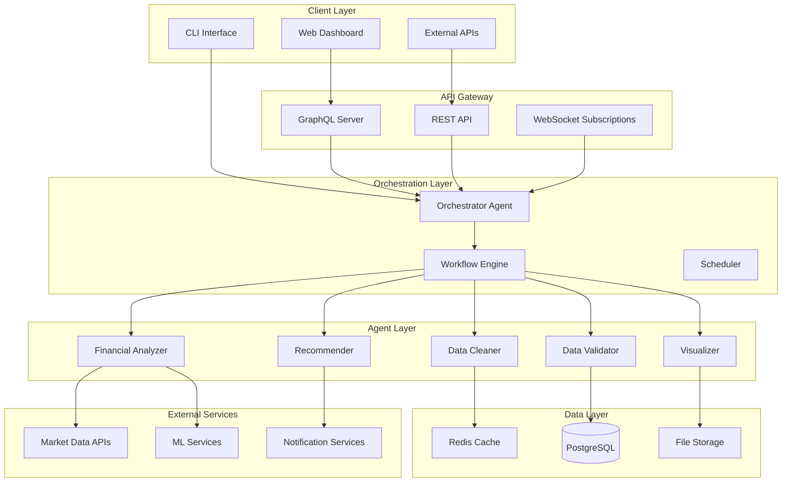

# Agentic Finance Workflow - Architecture Guide

## Overview

The Agentic Finance Workflow is a sophisticated multi-agent system designed for enterprise-grade financial data processing. This architecture guide provides a comprehensive overview of the system's design principles, components, and interactions.

## System Architecture

### High-Level Architecture



## Core Design Principles

### 1. Modularity
- **Independent Agents**: Each agent has a single responsibility and can operate independently
- **Pluggable Architecture**: Easy to add, remove, or replace agents without affecting others
- **Clear Interfaces**: Standardized communication protocols between agents

### 2. Scalability
- **Horizontal Scaling**: Agents can be scaled independently based on workload
- **Async Processing**: Non-blocking operations throughout the system
- **Resource Management**: Intelligent resource allocation and cleanup

### 3. Reliability
- **Error Handling**: Comprehensive error recovery and retry mechanisms
- **Circuit Breakers**: Prevent cascade failures across agents
- **Health Monitoring**: Continuous health checks and alerting

### 4. Maintainability
- **Clean Code**: Well-documented, testable code following SOLID principles
- **Configuration Management**: Externalized configuration for different environments
- **Observability**: Comprehensive logging, metrics, and tracing

## Agent Architecture

### Base Agent Framework

All agents inherit from the `BaseAgent` class, which provides:

```python
class BaseAgent(ABC):
    """Base class for all agents providing common functionality"""
    
    # Lifecycle management
    async def execute(input_data, context) -> AgentResult
    
    # Processing pipeline
    async def _validate_input(input_data, context)
    async def _preprocess(input_data, context)
    async def _process(input_data, context)  # Abstract method
    async def _postprocess(output_data, context)
    
    # Monitoring and health
    async def health_check() -> Dict[str, Any]
    def _update_metrics(**kwargs)
```

### Agent Types

#### 1. Data Cleaner Agent
**Purpose**: Clean and preprocess raw financial data

**Capabilities**:
- Missing value imputation
- Outlier detection and treatment
- Data type conversions
- Duplicate removal
- Financial data-specific validation

**Input**: Raw financial datasets (CSV, JSON, Parquet)
**Output**: Cleaned and validated datasets + quality reports

#### 2. Data Validator Agent
**Purpose**: Validate data quality and business rules

**Capabilities**:
- Schema validation
- Business rule enforcement
- Anomaly detection
- Regulatory compliance checks
- Data lineage tracking

**Input**: Cleaned datasets
**Output**: Validation reports + quality scores

#### 3. Financial Analyzer Agent
**Purpose**: Perform statistical and ML analysis

**Capabilities**:
- Technical indicator calculation
- Risk metric computation
- Portfolio optimization
- Predictive modeling
- Performance attribution

**Input**: Validated financial data
**Output**: Analysis results + insights

#### 4. Visualization Agent
**Purpose**: Generate charts, dashboards, and reports

**Capabilities**:
- Interactive chart generation
- Dashboard creation
- Report formatting
- Real-time visualization updates
- Export to multiple formats

**Input**: Analysis results
**Output**: Charts, dashboards, and reports

#### 5. Recommendation Agent
**Purpose**: Generate actionable trading and investment recommendations

**Capabilities**:
- Strategy recommendation
- Risk-adjusted suggestions
- Portfolio rebalancing advice
- Alert generation
- Performance tracking

**Input**: Analysis results + market data
**Output**: Ranked recommendations + rationale

#### 6. Orchestrator Agent
**Purpose**: Coordinate workflow execution

**Capabilities**:
- Workflow definition parsing
- Dependency resolution
- Parallel execution management
- Error recovery
- Human-in-the-loop integration

**Input**: Workflow definitions + parameters
**Output**: Execution results + monitoring data

## Data Flow Architecture

### 1. Data Ingestion
```
External APIs → Raw Data Storage → Data Cleaner Agent → Cleaned Data Cache
```

### 2. Processing Pipeline
```
Cleaned Data → Validator Agent → Analyzer Agent → Results Database
                                     ↓
                            Visualizer Agent → Static Assets
                                     ↓
                          Recommender Agent → Recommendations Queue
```

### 3. Real-time Updates
```
Market Data Stream → Event Bus → Active Agents → Client Notifications
```

## Communication Patterns

### 1. Synchronous Communication
- **GraphQL Queries**: Client to API layer
- **Agent Execution**: Orchestrator to agents
- **Database Operations**: Agents to data layer

### 2. Asynchronous Communication
- **Event Publishing**: Agent completion events
- **Message Queues**: Background processing
- **WebSocket Subscriptions**: Real-time client updates

### 3. Data Passing
- **Context Objects**: Metadata and configuration
- **Result Objects**: Standardized output format
- **Stream Processing**: Large dataset handling

## Security Architecture

### 1. Authentication & Authorization
- **JWT Tokens**: Stateless authentication
- **Role-Based Access Control**: Fine-grained permissions
- **API Key Management**: External service authentication

### 2. Data Protection
- **Encryption at Rest**: Database and file encryption
- **Encryption in Transit**: TLS for all communications
- **Data Anonymization**: PII protection in logs

### 3. Network Security
- **API Gateway**: Single entry point with rate limiting
- **Network Segmentation**: Isolated environments
- **Intrusion Detection**: Monitoring and alerting

## Deployment Architecture

### 1. Development Environment
```
Docker Compose:
- Application containers
- PostgreSQL database
- Redis cache
- Monitoring stack
```

### 2. Production Environment
```
Kubernetes Cluster:
- Auto-scaling agent pods
- Load-balanced API services
- Persistent data volumes
- Service mesh (Istio)
```

### 3. Infrastructure Components
- **Container Registry**: Docker images
- **Secret Management**: HashiCorp Vault
- **Service Discovery**: Kubernetes DNS
- **Load Balancing**: NGINX Ingress

## Monitoring & Observability

### 1. Metrics Collection
- **Application Metrics**: Custom business metrics
- **System Metrics**: CPU, memory, disk usage
- **Agent Metrics**: Execution time, success rate

### 2. Logging Strategy
- **Structured Logging**: JSON format with correlation IDs
- **Centralized Logging**: ELK stack or similar
- **Log Aggregation**: Cross-service tracing

### 3. Alerting & Monitoring
- **Prometheus**: Metrics collection and alerting
- **Grafana**: Visualization dashboards
- **PagerDuty**: Incident response

## Performance Considerations

### 1. Caching Strategy
- **Redis**: Hot data and session storage
- **Application Cache**: In-memory caching
- **CDN**: Static asset delivery

### 2. Database Optimization
- **Connection Pooling**: Efficient database connections
- **Query Optimization**: Indexed queries and materialized views
- **Read Replicas**: Read scaling

### 3. Agent Optimization
- **Parallel Processing**: Multi-threaded operations
- **Resource Pooling**: Shared computational resources
- **Lazy Loading**: On-demand resource allocation

## Disaster Recovery

### 1. Backup Strategy
- **Database Backups**: Automated daily backups
- **File System Backups**: Incremental backups
- **Configuration Backups**: Version-controlled configs

### 2. High Availability
- **Multi-Zone Deployment**: Geographic distribution
- **Auto-Failover**: Automatic service recovery
- **Health Checks**: Continuous availability monitoring

### 3. Recovery Procedures
- **RTO/RPO Targets**: 4-hour recovery objectives
- **Runbook Documentation**: Step-by-step procedures
- **Regular Testing**: Quarterly disaster recovery drills

## Integration Patterns

### 1. External API Integration
- **Circuit Breaker Pattern**: Fault tolerance
- **Retry with Backoff**: Resilient API calls
- **Rate Limiting**: Respect API quotas

### 2. Event-Driven Architecture
- **Event Sourcing**: Audit trail and replay capability
- **CQRS**: Separate read/write models
- **Saga Pattern**: Distributed transaction management

### 3. Microservices Communication
- **API Gateway**: Unified entry point
- **Service Mesh**: Inter-service communication
- **Contract Testing**: API compatibility verification

This architecture provides a robust, scalable, and maintainable foundation for enterprise financial data processing with AI agents.
